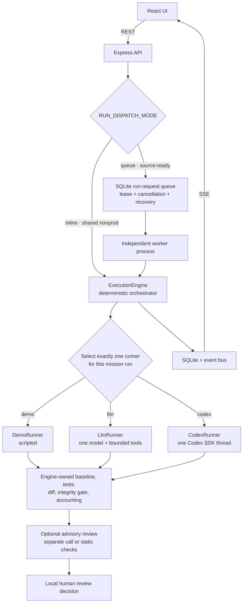

# Agent architecture and multi-agent status

> **2026-09-12 LangGraph / Langfuse update:** Local agents now use persistent stage workflows and metadata-only monitoring. See [agent operations](AGENT-OPERATIONS.md) for recovery, replay protection, commands and limits. Demo controls and the serving static release remain independent.

> **Self-update lane (2026-09-12):** A separate operator-enabled self-update controller now requests bounded frontend edits, verifies them in a container and optionally switches the local static release. Its enable/demo lock is independent of the advisory chaos loop and mission runner topology. [Runbook](SELF-UPDATE.md).

> **Local resilience update (2026-09-12):** A separate local resilience workflow now coordinates Chaos Agent hypotheses → fixed-catalog execution → Experiment Agent interpretation through a report handoff. This is a sequential advisory workflow, not the mission topology or an autonomous coding fleet. The historical mission description below remains separate. [Runbook](CHAOS-AGENTS.md).

[繁體中文](AGENT-ARCHITECTURE.zh-TW.md)

## Short answer

NxtCommit is **not a complex multi-agent system today**. For each mission run,
one `ExecutionEngine` instance selects exactly one `MissionRunner`: `DemoRunner`,
`LlmRunner`, or `CodexRunner`. The engine may make a separate advisory review
call after verification, and other API features may call a model, but those
calls do not delegate work to one another, exchange messages, vote, or operate
over a shared agent task graph.

If “AI-SRE-like multi-agent” means a supervisor coordinating persistent planner,
diagnoser, executor, and reviewer agents, NxtCommit does not currently have
that topology. It has **role-separated modules and model calls**, not a
cooperating agent team.

This document owns that classification. For the complete system and data model,
read [Architecture](ARCHITECTURE.md); for what is real, demo, or unimplemented,
read the [Feature reality matrix](FEATURE-REALITY.md).

## What “agent” means in this project

The word is used for several different things, which must not be conflated:

| Term | Meaning | Is it an autonomous collaborating agent? |
| --- | --- | --- |
| Execution engine | Deterministic controller for workspace setup, evidence, retries, gates, credits, and state | No; it is application code and the authority over evidence |
| Mission runner | The intelligence adapter selected for one mission run | It is the single task performer for that run |
| DemoRunner | Scripted reasoning and fixture-specific edits | No; it is labelled demo content |
| LlmRunner | One OpenAI-compatible model in a bounded tool loop | One model-driven runner, not an agent team |
| CodexRunner | One Codex SDK thread for local development | One model-driven runner, not an agent team |
| Diff reviewer / shadow reviewer | A separate, advisory model call or static fallback | No delegation or authority; it cannot promote or veto verified work |
| Issue, campaign, and explanation assistants | Independent request/response features behind API routes | Model-assisted features, not persistent workers |
| “Live agent” UI | SSE rendering of stored and current engine/runner events | A view of activity; in shared nonprod the runner content is scripted |

## Current topology

The three runner boxes below are alternatives. A mission does not start all
three.

The shared non-production application still runs the API and engine inline in
one TypeScript server process. Phase 3 source code now also provides a
transactional run-request queue and an independent worker process with leases,
cancellation, retries, and expired-lease recovery. It is not deployed in shared
nonprod because that environment still uses ephemeral SQLite on `emptyDir` and
does not provide a measured per-run isolation boundary. In either dispatch mode,
each mission has one selected runner and abort controller; runners do not
cooperate with or know about one another.

## Components and responsibilities

| Component | Current responsibility | Important boundary |
| --- | --- | --- |
| `server/engine/engine.ts` | Select a runner, create a run, execute up to three sequential attempts, verify results, record events and artifacts, and transition state | The engine—not the runner—owns authoritative evidence and reviewability |
| `server/dispatch.ts`, `server/queue.ts`, `server/worker.ts` | Select inline or queued dispatch; transactionally own, lease, cancel, retry, and recover run requests in a separate process | Queue mode is a source-complete foundation, not evidence of durable storage or per-run OS isolation |
| `server/engine/runners/types.ts` | Define the `MissionRunner.attempt()` intelligence boundary and structured attempt memory | One implementation is selected per run |
| `DemoRunner` | Apply authored plans and fixture-specific patches | Writes, tests, and diffs are observed; the intelligence is scripted |
| `LlmRunner` | Run one model for at most 14 turns with read/search/write/test/submit/abstain capabilities and deterministic budgets | Tool limits reduce cost and scope; they are not, by themselves, OS isolation |
| `CodexRunner` | Start one Codex SDK thread with workspace-write, network-off, and no-approval options | Uses a different workspace path from `LlmRunner`; local-only in the current packaging |
| `server/engine/judge.ts` | Review a verified diff through a separate model call when configured, otherwise use static checks | Advisory only; `computeReviewable()` and human review remain authoritative |
| `server/ai/*` | Issue triage, acceptance criteria, campaign generation/critique, project/evidence explanation, and shadow review | Each is an endpoint-scoped call with provenance and fallback, not an agent role in mission execution |
| `server/observability/*` | Emit logs, metrics, traces, generations, scores, and evaluation metadata | Observes calls; it does not coordinate them |

## One mission run, step by step

1. The API asks `ExecutionEngine` to execute an eligible fixture mission.
2. `resolveMode()` resolves `demo`, `llm`, or `codex`. `makeRunner()` constructs
   exactly that implementation.
3. The engine copies the fixture, freezes the environment/test plan, records the
   baseline, and applies the compute budget.
4. The selected runner performs one attempt. If verification fails, the engine
   may retry sequentially, up to three attempts total. The next attempt receives
   compact attempt history and engine-owned failure evidence; this is retry
   memory for the same runner mode, not delegation to another agent.
5. The engine performs the authoritative integrity checks, final test run, and
   baseline-relative diff.
6. When eligible, an independent reviewer call examines the real diff without
   the implementation reasoning. Its result is visible advice only.
7. A human reviews the local artifact. NxtCommit does not push a branch, open
   or merge a real GitHub pull request, tag, or publish a release.

## Why this is not a complex multi-agent architecture

| Multi-agent property | NxtCommit today |
| --- | --- |
| Supervisor delegates subtasks to specialist agents | Not implemented |
| Agent-to-agent messages or hand-offs | Not implemented |
| Shared task graph, blackboard, or agent memory | Not implemented; structured attempt history is engine-controlled retry input |
| Parallel agent fan-out on one mission | Not implemented |
| Debate, voting, consensus, or conflict resolution | Not implemented |
| Persistent agent registry, identities, or capabilities | Not implemented |
| Durable agent queue and isolated worker fleet | Lease-based queue and independent worker foundation implemented in source; durable shared storage, disposable per-run isolation, and deployment are not implemented |
| Several independent mission runs | Possible inline or through the queue, but they do not collaborate |
| Separate implementer and reviewer model calls | Implemented in eligible real modes, but this is separation of calls, not a coordinated agent team |

Several implementation details can otherwise create a false impression:

- **Three runner classes are choices, not teammates.** `makeRunner()` returns one.
- **Retries are sequential attempts by the selected runner path.** They do not
  create planner, fixer, and reviewer agents.
- **The reviewer is independent but advisory.** It receives evidence after the
  engine gate and cannot control mission state by itself.
- **Assistant endpoints are separate product features.** They do not join a
  mission conversation or share a coordinator.
- **SSE activity is telemetry, not inter-agent communication.** In shared
  nonprod, `DemoRunner` supplies scripted activity content.

## Runtime reality by environment

| Environment / input | What actually runs |
| --- | --- |
| Shared non-production deployment | Inline dispatch to `DemoRunner`; no queue worker and no real mission-execution model |
| Local `RUN_DISPATCH_MODE=queue` | SQLite run-request queue plus an independent worker process; durable only when `VAR_DIR` is on durable shared storage, and still not per-run OS isolation |
| Local `EXECUTION_MODE=llm` | One bounded `LlmRunner`, only with a measured per-run OS boundary or explicit disposable-local unsafe opt-in |
| Local `EXECUTION_MODE=codex` | One `CodexRunner` under the same permission rule; the production image does not provide the practical CLI path |
| Public GitHub import | Read-only metadata and issue analysis; the repository is not cloned or executed |
| Campaign/explanation APIs | May use real model calls when credentials and rollout policy allow; otherwise return labelled fallback output |

The runtime mode and provenance fields are the source of truth. UI animation,
the presence of an API key, or the generic word “agent” is not proof that a real
runner or a multi-agent workflow executed.

## Future direction

[Phase 3](PHASE-ROADMAP.md) is **in progress**. The queue schema, lease protocol,
independent worker process, cancellation/recovery path, worker metrics, and
commit-SHA capture are implemented and tested in source. The exit gate is still
open: shared nonprod remains inline, and durable shared storage plus one
disposable, measured isolation boundary per run are not deployed. Completing
those boundaries would improve execution isolation and ownership, but would not
automatically make the product multi-agent.

A future multi-agent design should be a separate, evidence-backed decision after
the Phase 3 boundary exists. A minimal candidate might use a coordinator, one
implementer, and an independent advisory verifier, while keeping deterministic
tests, diff integrity, state transitions, and final human authority in the
engine. It should only be promoted if experiments show a material improvement
over the single-runner baseline after accounting for cost, latency, duplicate
work, failure recovery, and auditability.

Do not describe this candidate as planned delivery or current capability. The
current roadmap promises an isolated worker boundary, not a supervisor-led agent
swarm.

## Where to verify the claim in code

| Claim | Source |
| --- | --- |
| One runner is selected | `server/engine/engine.ts` — `resolveMode()` and `makeRunner()` |
| Runner contract | `server/engine/runners/types.ts` — `MissionRunner` |
| Bounded single-model loop | `server/engine/runners/llmRunner.ts` |
| Single Codex thread | `server/engine/runners/codexRunner.ts` |
| Scripted demo intelligence | `server/engine/runners/demoRunner.ts` and `scenario.ts` |
| Advisory reviewer | `server/engine/judge.ts` |
| Other model-assisted calls | `server/ai/assistants.ts`, `campaign.ts`, and `explain.ts` |
| Queue and independent worker foundation | `server/dispatch.ts`, `server/queue.ts`, and `server/worker.ts` |
| Current truth labels | `docs/FEATURE-REALITY.md` |
| Security and isolation limits | `docs/SECURITY.md` |
| Phase 3 implementation status and remaining exit gate | `docs/PHASE-ROADMAP.md` |

## Maintenance rule

Do not call NxtCommit “multi-agent” merely because it contains multiple runner
implementations or makes more than one LLM request. Update this file and its
Traditional Chinese counterpart if a real delegation protocol, agent-to-agent
communication, shared task graph, or multiple cooperating task agents are added.
