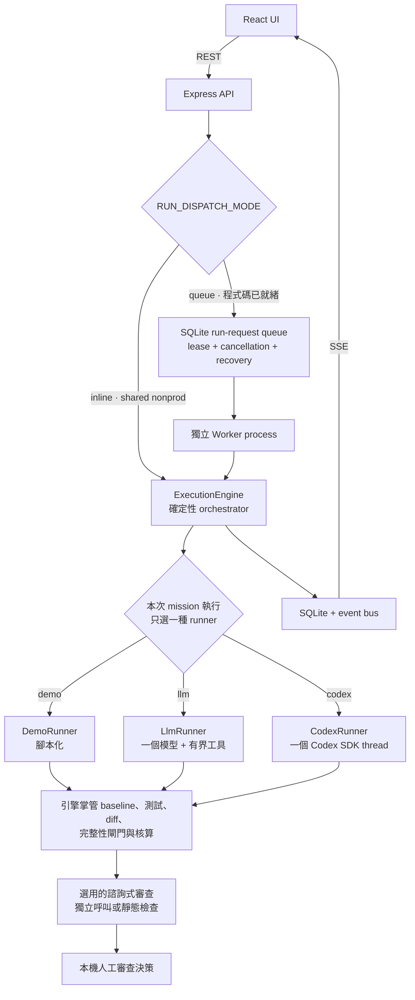

# Agent 架構與 multi-agent 現況

> **目前重建版本（Phase 3）：** 每個 run 由一個 scripted fixture engine 執行。Web server 與選用的獨立 queue worker 透過 SQLite 共享儲存狀態，是確定性程序，不是協作模型代理。C 輔助僅供建議，B 擁有 engine evidence 與任務狀態決策。下方歷史 LLM／Codex runner 並未由本次重建安裝，詳見[整合證據](PHASE3-INTEGRATION.zh-TW.md)。

> **2026-09-12 LangGraph / Langfuse 更新：** 本機 agents 已使用持久化階段流程與 metadata-only 監控；續跑、防重播、操作指令及限制請見 [Agent 操作手冊](AGENT-OPERATIONS.zh-TW.md)。既有 Demo 鎖與網站版本維持獨立。

> **Self-update lane (2026-09-12):** 另有操作者啟用的自我更新控制器：請模型提出有界前端修改、放入容器驗證，並選擇性切換本機靜態版本。其開關／Demo 鎖與建議型 chaos 迴圈及任務 runner 架構互相獨立。 [Runbook](SELF-UPDATE.zh-TW.md).

> **Local resilience update (2026-09-12):** 另有本機穩定度流程協調 Chaos Agent 假設 → 固定目錄執行 → 實驗 Agent 解讀，以報告交接。這是循序建議流程，不是任務 topology 或自主寫碼叢集；下方歷史任務架構需分開閱讀。 [Runbook](CHAOS-AGENTS.zh-TW.md).

[English](AGENT-ARCHITECTURE.md)

## 簡短答案

NxtCommit **目前不是複雜的 multi-agent 系統**。每一次 mission 執行都由
一個 `ExecutionEngine` 實例只選擇一個 `MissionRunner`：`DemoRunner`、
`LlmRunner` 或 `CodexRunner`。引擎可能在驗證後另外呼叫一次諮詢式 reviewer，
其他 API 功能也可能呼叫模型；但這些呼叫不會彼此委派工作、交換訊息、投票，
也不在共用的 agent 任務圖上運作。

如果「像 AI-SRE 的 multi-agent」是指 supervisor 協調長期存在的 planner、
diagnoser、executor 與 reviewer agent，NxtCommit 目前沒有這種拓樸。它具備
的是**角色分離的模組與模型呼叫**，不是共同協作的 agent 團隊。

本文件唯一負責這項分類。完整系統與資料模型請讀[架構](ARCHITECTURE.zh-TW.md)；
各功能是真實、demo 或尚未實作，請讀[功能真實性矩陣](FEATURE-REALITY.zh-TW.md)。

## 本專案中的「agent」是什麼

專案用這個詞表示數種不同事物，不可混為一談：

| 名稱 | 意義 | 是否為自主協作的 agent？ |
| --- | --- | --- |
| Execution engine | 管理工作區、證據、重試、閘門、點數與狀態的確定性控制器 | 否；它是應用程式碼，也是證據權威 |
| Mission runner | 一次 mission 執行所選擇的智慧介面 | 它是該次執行唯一的任務執行者 |
| DemoRunner | 腳本化推理與 fixture 專屬修改 | 否；內容明確標為 demo |
| LlmRunner | 一個 OpenAI 相容模型的有界工具迴圈 | 是單一模型 runner，不是 agent 團隊 |
| CodexRunner | 本機開發使用的一個 Codex SDK thread | 是單一模型 runner，不是 agent 團隊 |
| Diff reviewer／shadow reviewer | 獨立的諮詢式模型呼叫或靜態 fallback | 不委派且沒有決策權；不能晉級或否決已驗證工作 |
| Issue、campaign 與 explanation assistants | API route 後方各自獨立的請求／回應功能 | 是模型輔助功能，不是長期存在的 worker |
| 「即時 agent」UI | 透過 SSE 顯示已儲存與當前 engine／runner events | 是活動檢視；shared nonprod 的 runner 內容是腳本 |

## 目前拓樸

下圖三種 runner 是互斥選項；一個 mission 不會同時啟動三者。

共享 nonprod 目前仍由單一 TypeScript server process 以 inline 方式執行 API 與
引擎。Phase 3 程式碼已提供具交易性的 run-request queue，以及使用 lease、取消、
重試與過期 lease 復原的獨立 Worker process；但它尚未部署到 shared nonprod，
因為該環境仍在 `emptyDir` 使用 ephemeral SQLite，也沒有經量測的每次 run 隔離
邊界。無論 dispatch mode 為何，每個 mission 都只會選一個 runner 與 abort
controller；runner 彼此不合作，也不知道其他 runner 的存在。

## 元件與職責

| 元件 | 目前職責 | 重要邊界 |
| --- | --- | --- |
| `server/engine/engine.ts` | 選擇 runner、建立 run、執行最多三次循序嘗試、驗證結果、記錄 events 與 artifacts，並轉換狀態 | 權威證據與可審查性由引擎掌管，不由 runner 宣稱 |
| `server/dispatch.ts`、`server/queue.ts`、`server/worker.ts` | 選擇 inline 或 queue dispatch；以交易方式管理 run request 的 ownership、lease、取消、重試與獨立 process 復原 | Queue mode 是程式碼層的基礎，不代表已有 durable storage 或每次 run 的 OS 隔離 |
| `server/engine/runners/types.ts` | 定義 `MissionRunner.attempt()` 智慧邊界與結構化嘗試記憶 | 每次 run 只選一種實作 |
| `DemoRunner` | 套用人工撰寫的計畫與 fixture 專屬 patch | 寫入、測試與 diff 是觀察所得；智慧是腳本 |
| `LlmRunner` | 讓一個模型在最多 14 回合內使用 read/search/write/test/submit/abstain 能力與確定性 budgets | 工具限制縮小成本與範圍，但本身不是 OS 隔離 |
| `CodexRunner` | 以 workspace-write、停用網路與不要求核准啟動一個 Codex SDK thread | 不走 `LlmRunner` 的工作區路徑；目前包裝僅供本機使用 |
| `server/engine/judge.ts` | 有設定時用獨立模型呼叫審查已驗證 diff，否則使用靜態檢查 | 僅供諮詢；`computeReviewable()` 與人工審查仍具權威 |
| `server/ai/*` | Issue 分類、驗收條件、募資文案產生／批判、專案／證據解說與 shadow review | 每一項都是有 provenance 與 fallback 的 endpoint 級呼叫，不是 mission 內的 agent 角色 |
| `server/observability/*` | 產生日誌、metrics、traces、generations、scores 與 evaluation metadata | 它觀察呼叫，不協調呼叫 |

## 一次 mission 如何執行

1. API 要求 `ExecutionEngine` 執行一個符合資格的 fixture mission。
2. `resolveMode()` 決定 `demo`、`llm` 或 `codex`；`makeRunner()` 只建立該實作。
3. 引擎複製 fixture、凍結環境／測試計畫、記錄 baseline，並套用運算預算。
4. 選定的 runner 執行一次 attempt。若驗證失敗，引擎可以循序重試，總共最多
   三次。下一次 attempt 會收到精簡的 attempt history 與引擎擁有的失敗證據；
   這是相同 runner mode 的重試記憶，不是把工作委派給另一個 agent。
5. 引擎執行權威的完整性檢查、最終測試與相對 baseline 的 diff。
6. 符合條件時，獨立 reviewer 呼叫會在看不到實作推理的情況下檢查真實 diff；
   結果只作為可見建議。
7. 人類審查本機 artifact。NxtCommit 不會推送 branch、建立或合併真正的
   GitHub Pull Request、打 tag 或發布 release。

## 為何這不是複雜 multi-agent 架構

| Multi-agent 特徵 | NxtCommit 目前現況 |
| --- | --- |
| Supervisor 把子任務委派給專職 agents | 尚未實作 |
| Agent 之間傳訊或 hand-off | 尚未實作 |
| 共用 task graph、blackboard 或 agent memory | 尚未實作；結構化 attempt history 是引擎控制的重試輸入 |
| 同一 mission 平行展開多個 agents | 尚未實作 |
| 辯論、投票、共識或衝突解決 | 尚未實作 |
| 長期存在的 agent registry、身分或能力宣告 | 尚未實作 |
| Durable agent queue 與隔離 worker fleet | Lease-based queue 與獨立 Worker 基礎已在程式碼實作；durable shared storage、每次 run 的 disposable isolation 與部署尚未實作 |
| 多個彼此獨立的 mission runs | Inline 或 queue 都可處理，但它們不會協作 |
| 分離的 implementer 與 reviewer 模型呼叫 | 符合條件的真實模式已實作，但這是呼叫分離，不是協調式 agent 團隊 |

以下實作細節也很容易造成錯覺：

- **三種 runner class 是選項，不是隊友。** `makeRunner()` 只回傳一個。
- **重試是選定 runner 路徑的循序 attempts。** 不會因此建立 planner、fixer 與
  reviewer agents。
- **Reviewer 獨立但只供諮詢。** 它在引擎閘門後收到證據，不能自行控制 mission
  狀態。
- **Assistant endpoints 是分開的產品功能。** 它們不會加入 mission 對話，也不
  共用 coordinator。
- **SSE 活動是 telemetry，不是 agent 之間的通訊。** Shared nonprod 中的
  `DemoRunner` 活動內容是腳本。

## 各環境的真實執行情況

| 環境／輸入 | 實際執行內容 |
| --- | --- |
| Shared non-production deployment | Inline dispatch 到 `DemoRunner`；沒有 queue worker，也沒有真實的 mission-execution 模型 |
| 本機 `RUN_DISPATCH_MODE=queue` | SQLite run-request queue 加獨立 Worker process；只有 `VAR_DIR` 位於 durable shared storage 時才具持久性，且仍不是每次 run 的 OS 隔離 |
| 本機 `EXECUTION_MODE=llm` | 一個有界 `LlmRunner`；必須有量測過的每次執行 OS 邊界，或明確承認可拋棄本機風險 |
| 本機 `EXECUTION_MODE=codex` | 同一權限規則下的一個 `CodexRunner`；production image 沒有實用 CLI 路徑 |
| 公開 GitHub import | 唯讀 metadata 與 issue 分析；不 clone、不執行該 repo |
| Campaign／explanation APIs | 憑證與 rollout policy 允許時可能真的呼叫模型，否則回傳有標示的 fallback |

Runtime mode 與 provenance fields 才是事實來源。UI 動畫、環境中存在 API key，
或泛稱「agent」，都不能證明真實 runner 或 multi-agent workflow 曾經執行。

## 未來方向

[Phase 3](PHASE-ROADMAP.zh-TW.md)目前**進行中**。Queue schema、lease protocol、
獨立 Worker process、取消／復原路徑、Worker metrics 與 commit SHA 擷取，皆已在
程式碼實作並通過測試；exit gate 仍未關閉：shared nonprod 維持 inline，durable
shared storage 與每次 run 一個可拋棄、經量測的隔離邊界都尚未部署。完成這些邊界
會改善執行隔離與 ownership，但不會自動讓產品變成 multi-agent。

未來的 multi-agent 設計應該在 Phase 3 邊界存在後，另外用證據決定。最小候選
拓樸可以包含 coordinator、一個 implementer 與獨立的諮詢式 verifier，同時讓
確定性測試、diff 完整性、狀態轉換與最終人工權限留在引擎。只有在實驗證明它相對
單一 runner baseline 有實質改善，而且計入成本、延遲、重複工作、失敗復原與
可稽核性後，才應晉級。

不可把這個候選描述成已排程交付或目前能力。現行 roadmap 承諾的是隔離 worker
邊界，不是 supervisor 帶領的 agent swarm。

## 如何從程式碼驗證

| 主張 | 來源 |
| --- | --- |
| 只選一個 runner | `server/engine/engine.ts` 的 `resolveMode()` 與 `makeRunner()` |
| Runner contract | `server/engine/runners/types.ts` 的 `MissionRunner` |
| 有界單模型迴圈 | `server/engine/runners/llmRunner.ts` |
| 單一 Codex thread | `server/engine/runners/codexRunner.ts` |
| 腳本化 demo 智慧 | `server/engine/runners/demoRunner.ts` 與 `scenario.ts` |
| 諮詢式 reviewer | `server/engine/judge.ts` |
| 其他模型輔助呼叫 | `server/ai/assistants.ts`、`campaign.ts` 與 `explain.ts` |
| Queue 與獨立 Worker 基礎 | `server/dispatch.ts`、`server/queue.ts` 與 `server/worker.ts` |
| 現況真實性標籤 | `docs/FEATURE-REALITY.zh-TW.md` |
| 安全與隔離限制 | `docs/SECURITY.zh-TW.md` |
| Phase 3 實作狀態與剩餘 exit gate | `docs/PHASE-ROADMAP.zh-TW.md` |

## 維護規則

不可只因為專案有多個 runner 實作或發出多次 LLM request，就稱 NxtCommit 為
「multi-agent」。未來若加入真正的委派協定、agent-to-agent 通訊、共用 task graph
或多個共同合作的任務 agents，必須同步更新本文件與英文對照。
