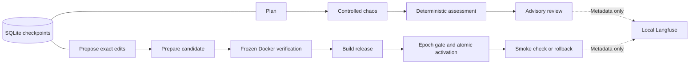

# Local LangGraph agents and Langfuse monitoring

[繁體中文](AGENT-OPERATIONS.zh-TW.md)

LangGraph JS 1.4.15 coordinates the existing TypeScript agents; the official SQLite
checkpointer 1.0.4 persists stage boundaries. Langfuse 4.35.0 runs as an independent
local Docker Compose stack. A graph is orchestration, not permission for a model
to change tests, tools, commands, deployment policy or the demo lock.



## Run and observe

Use Node 24. After `npm ci`, allow the native `better-sqlite3` build when the
local npm install-script policy blocks it: `npm rebuild better-sqlite3 --ignore-scripts=false`.
The verifier image explicitly builds this dependency; candidate containers never
install packages or access the network.

```bash
npm run agents:monitor -- up
npm run agents:monitor -- status
npm run agents:experiment -- --live
npm run agents:monitor -- verify
npm run agents:monitor -- stop
```

Langfuse UI: `http://127.0.0.1:4310`. Login is
`maintainer@nxtcommit.local`; the generated password is `ADMIN_PASSWORD` in
ignored `var/langfuse/.env` (0600). Never paste this file into logs or a report.
The project is `nxtcommit-agents`. Docker volumes persist across `stop`/`up`.
Images are pinned by digest, signup and Langfuse product telemetry are disabled,
and only the UI and MinIO port 4311 are published, both on loopback. No automatic
Langfuse upgrade, cloud export, or model connection inside Langfuse is configured.
This resource-limited stack is for local development, not a production HA setup.

Agent CLIs load the local monitoring configuration. Set `AGENT_TRACING_ENABLED=false`
in the process environment to disable export; it never changes update permissions.
Use `verify <trace-id>` to check a specific trace from the last 24 hours. Verification
queries Observations API v2; HTTP ingestion acceptance alone is not persistence
proof. Langfuse v4 removed the old `/api/public/traces` read endpoint.

Exported data includes stage names, parent/child relationships, actual durations,
source identity, deterministic gate counts, bounded outcome codes, prompt version,
model and provider token counts when available. Langfuse may estimate costs from
its model price catalog; those are not billing receipts. Missing usage remains
unknown. Raw prompts, goals, source files, edits, responses, credentials and raw
errors are excluded. Automatic LangChain/LangSmith tracing is disabled; explicit
allowlisted OTLP spans avoid automatic callback capture of source/goal data.
A failed export is recorded in `var/agents/exports.jsonl` and never changes a gate.
Export is bounded to two seconds, with no unbounded retry queue.

## Durable update recovery

The [self-update controls](SELF-UPDATE.md) remain authoritative. The CLI is off
and demo-locked by default. Start a new run with `agents:update -- run`; recover
an interrupted or failed stage with:

```bash
npm run agents:update -- resume <run-id>
```

Recovery requires the same epoch, goal, model, controller source, dependency lock,
verifier configuration and active baseline (or the already activated candidate).
Turning off/on, toggling demo mode or changing the goal invalidates old checkpoints.
Completed stages are skipped; a persisted proposal is reused, verification can be
repeated, and a finished activation is not replayed. Artifacts are checked before
verification and promotion. A finished cancelled/no-change graph stays finished.
There is no automatic replay of failed model calls or automatic resume at startup.
If the process dies after the provider charges a call but before saving the proposal,
manual resume can issue another call; exactly-once provider billing is not promised.

Only the operator `resume` command can recover an iteration lock whose recorded
PID no longer exists. A live PID or missing/corrupt owner fails closed. A hard kill
inside the short control-lock/activation transaction requires operator inspection
of the pointer and lock; it is not automatic crash-safe deployment recovery.
SIGTERM/SIGINT cancellation cleans up normally. Inspect candidate `context.json`,
`result.json`, `attempts/`, and verifier logs locally; no public control API exists.

Experiment runs also persist plan, measurements, assessment, report and graph
checkpoints under `var/chaos-agents/runs/`. The experiment CLI starts a fresh run
per cycle; update `resume` does not resume experiments. Successful deterministic
checks do not establish semantic quality or production availability.

## Verifier and local evidence

```bash
docker --context colima build -f e2e/Dockerfile -t nxtcommit-agent-verifier:local .
npm run agents:update -- verifier
```

`verifier` retains a dedicated image tag and rotates the update epoch. Override
`SELF_UPDATE_VERIFIER_IMAGE` only for an intentional local image change. Existing
static releases and their source snapshots remain unchanged by a controller upgrade.

On 2026-09-12, the real two-role OpenAI experiment passed 34/34 controlled checks;
Langfuse v2 readback returned eight observations, including both generations and
provider token usage. Automated tests cover SQLite reopen/resume, duplicate work,
epoch cancellation, full update activation, raw-error/secret containment, partial
OTLP rejection and exporter failure. Controlled tests use synthetic model/verifier
adapters; they do not claim a new model-authored website release was activated.

References: [LangGraph persistence](https://docs.langchain.com/oss/javascript/langgraph/persistence),
[Langfuse local deployment](https://langfuse.com/self-hosting/deployment/docker-compose),
[headless initialization](https://langfuse.com/self-hosting/administration/headless-initialization),
[OTLP attribute contract](https://langfuse.com/integrations/native/opentelemetry),
[Observations API v2](https://langfuse.com/docs/api-and-data-platform/features/observations-api).

## Slice handoff

- Owned policy: `policy.self-update` checkpoint-epoch and trace-containment, wired through both agent CLIs, `workflow.ts`, `telemetry.ts` and the update controller.
- Outcome tests: `server/agents/workflow.test.ts` and `server/self-update/workflow.test.ts` reach persisted resume, cancellation and activation; existing control tests retain rollback coverage.
- Verification: `npm run check`, version check, 127-spec lint, Docker tests and all 12 foundation/Computer C browser journeys pass. Existing 54 TODO scenarios remain outside this slice.
- Real update probe: isolated run `4b2c6eec-d303-4ea3-ad16-33e5ef718d91` returned `no-change`; Langfuse readback found its root, proposal stage and actual generation. Serving settings and release were unchanged.
- Central integration required: none for these local CLIs. Mission execution remains outside this agent workflow. The historical `scripts/phase4-gate.sh` referenced by the maintainer template is absent in this reconstruction; no phase-4 completion is claimed.
- Known limits: explicit recovery after failure, trusted local operator, bounded frontend editing, no cloud delivery or automatic Git merge, and the hard-kill control-transaction limitation described above.
