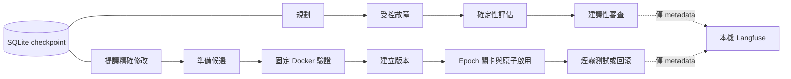

# 本機 LangGraph agents 與 Langfuse 監控

[English](AGENT-OPERATIONS.md)

使用 LangGraph JS 1.4.15 協調既有 TypeScript agents，官方 SQLite checkpointer
1.0.4 保存階段進度。Langfuse 4.35.0 為獨立本機 Docker Compose 服務。
流程圖只負責協調；模型仍不能變更測試、工具、指令、部署政策或 Demo 鎖。



## 執行與觀察

使用 Node 24。若 `npm ci` 的安裝指令政策阻擋原生套件建置，執行
`npm rebuild better-sqlite3 --ignore-scripts=false`。驗證映像明確建置此依賴；
候選容器不安裝套件、不連網。

```bash
npm run agents:monitor -- up
npm run agents:monitor -- status
npm run agents:experiment -- --live
npm run agents:monitor -- verify
npm run agents:monitor -- stop
```

Langfuse 網址為 `http://127.0.0.1:4310`。登入帳號為本機設定中的
`LANGFUSE_INIT_USER_EMAIL`（預設 `maintainer@nxtcommit.local`），密碼為 ignored
`var/langfuse/.env`（0600 權限）中的 `ADMIN_PASSWORD`。不要把此檔案貼入紀錄或報告。
專案為 `nxtcommit-agents`。Docker volumes 在 `stop`／`up` 後保留資料。
映像以 digest 固定，停用註冊與 Langfuse 產品遙測；只有 UI 與 MinIO 4311
連接埠發布至 loopback。未設定自動升級、雲端匯出或 Langfuse 內部模型連線。
此資源受限配置供本機開發使用，不是正式高可用部署。

Agent CLI 會讀取本機監控設定。在程序環境設定 `AGENT_TRACING_ENABLED=false`
即可停用匯出；它不影響更新權限。用 `verify <trace-id>` 驗證最近 24 小時的指定
追蹤。驗證使用 Observations API v2；只有 ingestion HTTP 成功不代表已入庫。
Langfuse v4 已移除舊的 `/api/public/traces` 讀取端點。

匯出內容包含階段名稱、父子關係、實際耗時、來源識別、確定性關卡計數、受限狀態碼、
prompt 版本、模型，以及供應商有回傳的 token 用量。Langfuse 可依模型價目表估算
成本，但不是帳單；未知用量維持未知。原始 prompt、目標、原始碼、修改、回覆、金鑰與
原始錯誤均不匯出。停用 LangChain／LangSmith 自動 tracing，使用明確白名單 OTLP
避免自動 callback 捕捉原始碼與目標。匯出失敗記錄於 `var/agents/exports.jsonl`，
不會改變關卡結果；匯出限時兩秒，沒有無限重試佇列。

## 更新續跑

[自我更新控制](SELF-UPDATE.zh-TW.md) 仍具最終權限，CLI 預設關閉並 Demo 鎖定。
使用 `agents:update -- run` 建立新執行，透過下列指令續跑中斷或失敗的階段：

```bash
npm run agents:update -- resume <run-id>
```

續跑要求 epoch、目標、模型、控制器原始碼、依賴 lock、驗證環境及目前基準版本相同
（或目前已是該候選）。關閉再開啟、切換 Demo 或修改目標都會使舊 checkpoint 失效。
完成的階段會略過，已保存的提案會重用，可重跑驗證，已完成啟用不會再次切換。
驗證及啟用前檢查 artifact 完整性。已取消／無修改的流程維持結束狀態。
不自動重試失敗的模型呼叫，也不在啟動時自動續跑。若程序在供應商計費後、保存提案前
死亡，手動續跑可能再呼叫一次；不保證供應商只計費一次。

Worker 現在持有 SQLite 寫入鎖，程序死亡後由作業系統釋放；不要刪除 lock database。
升級前先停止舊 worker；舊版目錄鎖存在時會拒絕啟動。啟用前先寫 journal，煙霧驗證後
寫入收據。下一次控制操作會處理中斷的切換：若沒有完成收據，會先還原前一版本，再確認
Demo 凍結；已完成收據可避免重播。測試實際以 SIGKILL 終止子程序；不宣稱已驗證斷電
或多主機／NFS 復原。可於本機檢查候選的 `context.json`、`result.json`、`attempts/`、
啟用收據及驗證紀錄。

Experiment 會將 plan、每個已完成 measurement、assessment 與 report 保存於
`var/chaos-agents/runs/`。SIGTERM／SIGINT 會傳入模型與私有 HTTP 請求。
可以使用原設定與原始碼續跑中斷的工作：

```bash
npm run agents:experiment -- --resume <run-id>
npm run agents:benchmark
npm run agents:benchmark -- --live
```

續跑不重做已保存案例；不完整或重複的 scenario／repetition 組合不能通過評估。
Catalog v2 有 19 個案例，預設重複次數產生 38 項檢查。Benchmark 跑三組種子，共
114 項檢查；live 模式對全部八個建議角色最多呼叫八次模型。結果位於
`var/agent-benchmarks/<id>/report.json`。它不會啟用或推進自我更新。
格式、來源與隔離檢查不代表模型語意品質量測。

## 驗證映像與證據

```bash
docker --context colima build -f e2e/Dockerfile -t nxtcommit-agent-verifier:local .
npm run agents:update -- verifier
```

`verifier` 保留專用映像標籤並撤銷舊 epoch。只有刻意變更本機映像時才覆寫
`SELF_UPDATE_VERIFIER_IMAGE`。控制器升級不會變更既有靜態版本及其原始碼快照。

2026-09-12 的真實雙角色 OpenAI experiment 通過 34/34 受控檢查；Langfuse v2
查回八筆觀察，包含兩次模型生成與供應商 token 用量。自動測試涵蓋 SQLite 重開續跑、
避免重複工作、epoch 取消、完整更新啟用、原始錯誤／秘密隔離、OTLP 部分拒絕及匯出故障。
受控測試使用合成模型／驗證器，不代表本輪已啟用新的模型網站版本。

參考：[LangGraph persistence](https://docs.langchain.com/oss/javascript/langgraph/persistence)、
[Langfuse 本機部署](https://langfuse.com/self-hosting/deployment/docker-compose)、
[無介面初始化](https://langfuse.com/self-hosting/administration/headless-initialization)、
[OTLP 欄位契約](https://langfuse.com/integrations/native/opentelemetry)、
[Observations API v2](https://langfuse.com/docs/api-and-data-platform/features/observations-api)。

## 垂直切片交接

- 負責政策：`policy.self-update` 的 checkpoint-epoch 與 trace-containment，已串接兩個 agent CLI、`workflow.ts`、`telemetry.ts` 及更新控制器。
- 終態測試：`server/agents/workflow.test.ts` 與 `server/self-update/workflow.test.ts` 驗證持久化續跑、取消及啟用；既有 control 測試保留回滾覆蓋。
- 驗證：`npm run check`、版本檢查、127 項 spec lint、Docker 測試及 12 條 foundation／Computer C 瀏覽器流程通過；既有 54 項 TODO 不屬於本切片。
- 真實更新探針：隔離執行 `4b2c6eec-d303-4ea3-ad16-33e5ef718d91` 回傳 `no-change`；Langfuse 查回 root、proposal 階段與真實模型生成。服務中的設定與版本未變更。
- 中央整合：本機 CLI 無待接線項目；mission execution 不屬於此 agent 流程。維護模板提到的歷史 `scripts/phase4-gate.sh` 在此重建版不存在，不宣稱 phase-4 已完成。
- 已知限制：失敗後需明確續跑、信任本機操作員、僅限受控前端修改、沒有雲端交付或 Git 自動合併；不宣稱已驗證斷電或多主機復原。
