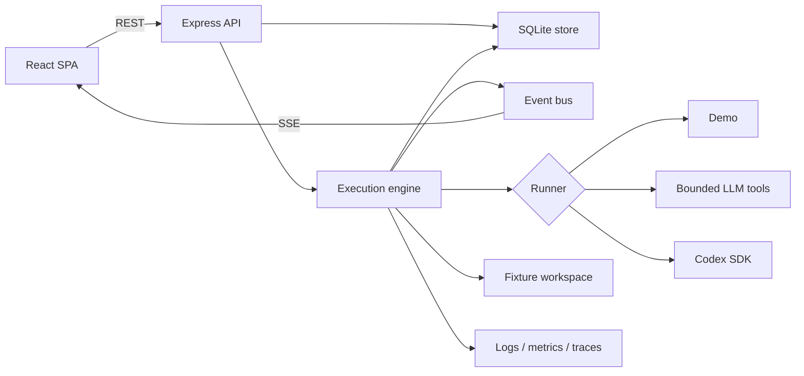
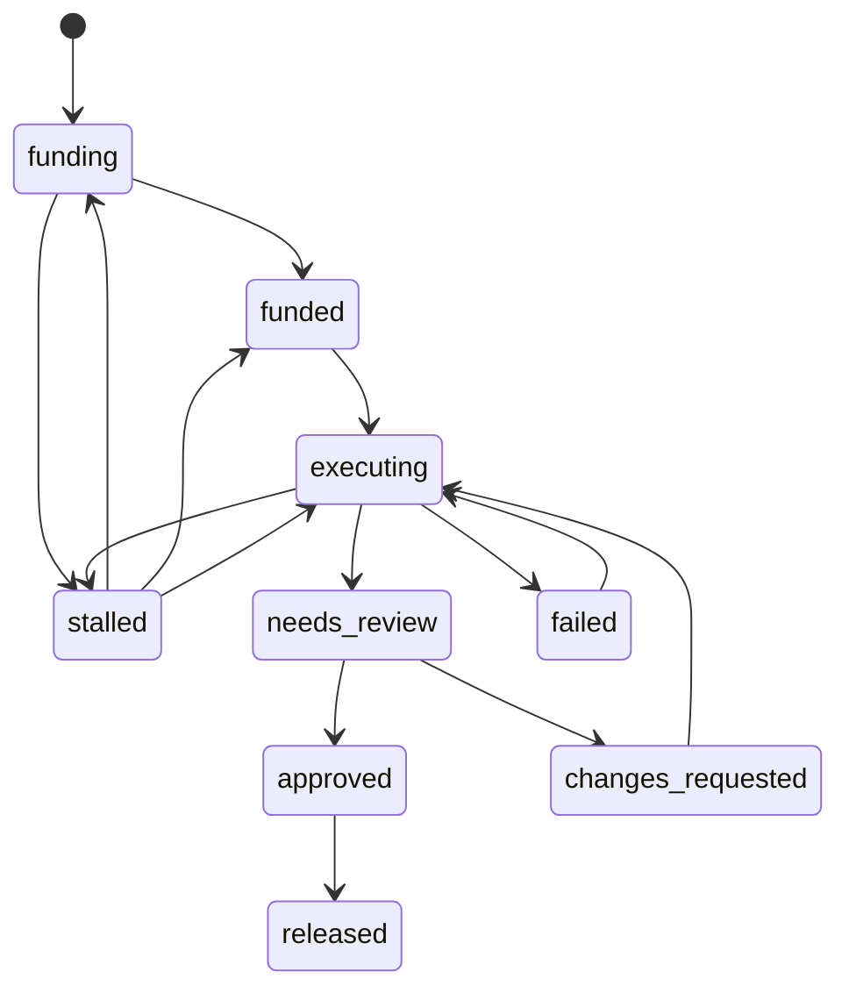

# Architecture

[繁體中文](ARCHITECTURE.zh-TW.md)

This document describes the current implementation. It intentionally separates implemented behaviour from the product direction in `ROADMAP.md` and the historical observations in `experiment-report.md`.

For the runner topology and a precise explanation of why multiple runner classes
and model calls do not make the current system multi-agent, see
[Agent architecture and multi-agent status](AGENT-ARCHITECTURE.md).

## Design centre

CommonCommit is built around one rule:

> The engine owns evidence; a runner supplies intelligence.

A runner may inspect a fixture, propose edits, execute an allowed test capability, and explain its work. The engine creates the workspace, records the baseline, reruns verification, computes the diff, applies the deterministic review gate, accounts for credits, and controls state transitions.

This boundary limits what a runner can claim, but it is not complete isolation. The three runner implementations do not share an identical tool path, and the controls differ by measured isolation mode — a per-run container where one is available, application-level workspace and subprocess controls—not a sandbox. See `SECURITY.md` before treating any part of it as a production security boundary.

## System overview

The application is one TypeScript package and one server process:

| Area | Responsibility |
| --- | --- |
| `src/` | React 19 SPA, routing, state, SSE updates, and en/zh-TW copy |
| `server/index.ts` | HTTP server, health endpoints, static frontend, and shutdown |
| `server/api.ts` | Marketplace, mission, review, analysis, campaign, and demo endpoints |
| `server/store.ts` | The only domain-data access layer |
| `server/db.ts` | SQLite schema, writable state directory, IDs, and timestamps |
| `server/engine/engine.ts` | Execution lifecycle, retries, accounting, artifacts, and approval flow |
| `server/engine/states.ts` | Explicit mission and run transition tables |
| `server/engine/workspace.ts` | Fixture copies, Git baselines, tests, diffs, and output parsing |
| `server/engine/guard.ts` | Evidence fencing, redaction, LLM-tool write rules, and reviewability |
| `server/engine/tools.ts` | Bounded capabilities exposed to `LlmRunner` |
| `server/engine/judge.ts` | Advisory review of an already verified diff |
| `server/ai/` | Read-only repository analysis, feasibility heuristic, and campaign copy |
| `server/observability/` | Structured logs, Prometheus, and optional Langfuse traces |

## Request and event flow

The browser loads initial user and execution information from `/api/bootstrap`, then reads marketplace and mission resources through REST. Global and mission-specific SSE streams deliver subsequent changes.

The API has no version prefix, authentication, authorization, or rate limiting. It is a prototype API used by the bundled UI; callers must not infer a stable public contract.

Main endpoint groups:

| Group | Endpoints |
| --- | --- |
| Service | `GET /healthz`, `/readyz`, `/metrics` |
| Read models | `GET /api/bootstrap`, `/marketplace`, `/missions/:id`, `/runs/:id`, `/contributors/:id` |
| Mission flow | `POST /api/missions/:id/pledge`, `/execute`, `/cancel` |
| Review | `POST /api/runs/:id/review` |
| Creation | `POST /api/analyze`, `/campaigns/generate`, `/missions` |
| Demo | `POST /api/demo/reset` |
| Events | `GET /api/stream`, `/api/missions/:id/stream` |

The review endpoint ignores authority identities from the browser and records the current local demo persona. This prevents identity spoofing inside the prototype, but it is still not authentication or authorization.

## Mission execution

Only projects whose workspace is `{ kind: "fixture" }` can execute. GitHub-backed repositories can be analyzed and can produce an editable campaign draft through either the validated real generator or the visibly labelled deterministic GitHub fallback. Execution remains disabled because the server does not clone them.

A fixture run follows this sequence:

1. Reserve the mission's remaining compute budget and create a run row.
2. Copy the fixture into a per-run directory and create an initial Git baseline.
3. Derive an install and test plan from repository files.
4. Provision dependencies when required, then seal the resulting engine-owned files and ignored-file inventory into the baseline.
5. Run the frozen baseline suite; stop before model spend if it is red, empty, or unreadable.
6. Invoke the selected runner for up to three attempts.
7. Compare the full tree with the captured baseline commit and block protected, hidden ignored, or unverifiable changes before the engine-owned authoritative final suite. A runner may already have executed modified code through its own tool or SDK path, which is why this is an evidence-integrity gate rather than isolation.
8. Rerun the frozen test plan through the engine, re-check Git and ignored-file integrity after executable test code returns, then compute the baseline-relative diff and evaluate the review gate.
9. If reviewable, run the advisory judge and create a change-evidence package; no branch or PR is pushed.
10. Wait for a CommonCommit API/UI demo decision; this is not GitHub approval.
11. On approval, update local mission, ledger, wallet, achievement, and demo-adoption records.

Real `llm` and `codex` runners require one of two things, and they are not
equivalent:

- a **measured** per-run OS boundary (`describeIsolation().osIsolated`), which
  `server/engine/isolation.ts` establishes by probing — it actually mounts the
  workspace root in a container and reads a token back, because "a daemon answers
  and an image exists" is a different question from "a workspace can be run"; or
- `ALLOW_UNSAFE_LOCAL_AGENT_EXECUTION=1`, which is a human promise that the host
  is disposable and adds no protection at all. It stays supported only so a laptop
  without Docker can develop the runners.

`auto` stays `demo` even with a verified boundary. Isolation answers "is this safe
to run"; it does not answer "did the operator ask for it", and finding a
credential in the environment is not consent. An explicit `EXECUTION_MODE` is the
consent signal.

Shared nonprod remains on `demo`: the GKE pod has no Docker daemon, so the probe
there reports `process` and SEC-00's P0 gate is not met in the cluster. See
`SECURITY.md` and the dated result in `experiment-report.md`.

Credit-moving requests accept an optional `Idempotency-Key` header. The key is
recorded in the same transaction as the effect, so a duplicate cannot half-apply,
and reusing one key for a different request is refused rather than answered with
the first request's response. A request without the header is unprotected: the
server cannot distinguish an accidental retry from a deliberate second pledge of
the same amount, so only the client can say which it meant.

### Runner implementations

| Runner | How it works | Important boundary |
| --- | --- | --- |
| `DemoRunner` | Emits scripted reasoning and applies fixture-specific patches | Narrative and edits are scripted; engine tests and live-run diff are observed |
| `LlmRunner` | Calls an OpenAI-compatible chat-completions API and lets the model select constrained tools | Model-directed interaction and fixed prefetch reads use contained workspace helpers |
| `CodexRunner` | Starts the Codex SDK with workspace-write, network-off, no-approval options and a filtered child environment | Does not use the seven `LlmRunner` tools; the engine therefore enforces protected paths again on the baseline-relative diff before tests |

The UI must label the selected runner. Seeded historical events are `source: "demo"`; they were not produced by a live engine run.

### Bounded LLM tools

`LlmRunner` has a hard maximum of 14 model turns per attempt. The 24 non-terminal tool calls, 200 KB read budget, 200 KB cumulative write budget, 80 KB per-file write limit, and bounded file listing are enforced. Oversized operations are refused before charging; listing and literal search charge the bytes they expose or scan, and only `submit` or `abstain` remain available once the call budget is exhausted. These are deterministic cost controls, not, by itself, OS isolation.

| Tool | Capability |
| --- | --- |
| `list_files` | List a bounded number of non-symlink files outside `.git` and `node_modules`, charged to the read budget |
| `read_file` | Read a contained path, then redact and fence its contents |
| `search` | Search for bounded literal text with bounded results and charged read bytes |
| `write_file` | Write a complete file through containment, denylist, per-file, and cumulative byte checks |
| `run_tests` | Use the engine-derived test capability |
| `submit` | Ask to end the attempt after the submission gate passes |
| `abstain` | Stop deliberately when the mission needs a human decision |

Before accepting `submit`, the tool layer requires at least one write, at least one test run, a green last suite, and prior reads of changed source files. The engine still performs its own final run afterwards.

### Deterministic review gate

`computeReviewable()` is the only successful live-execution gate from `executing` to `needs_review`. Seed records and recovery of an unexecutable requested-change run can restore review UI state without creating fresh engine evidence; those paths must remain visibly non-verified. A successful test process is necessary but not sufficient. The current gate requires:

- exit code 0 and no reported failures;
- a non-empty diff;
- at most 12 changed files and 800 added-plus-deleted lines;
- a final test count no lower than the baseline and greater than zero;
- for non-documentation changes, a new test file or growth in the suite;
- no detected prompt-injection indicator.
- no change to existing tests, verification configuration, lockfiles, ignore rules, CI, licence, Git internals, or other protected baseline paths;
- no runner-created ignored file that could affect execution while disappearing from the artifact.

The gate derives these facts from the captured baseline commit, workspace, and test output, not from the runner's summary or current `HEAD`. Unreadable reporter output is recorded as an engine limitation instead of being interpreted as zero passing tests. Aggregate suite success persists as `suite_passed`; it is not criterion-level verification.

### Advisory review

After the deterministic gate passes, `judge.ts` reviews the real diff. In any non-demo mode with a configured compatible LLM endpoint—including Codex mode—it uses the configured execution model; otherwise it performs static diff-shape checks. The artifact records whether the result came from `llm` or `static` review.

The judge cannot advance or reject a run. It supplies risks and unverified questions for a human; state progression remains deterministic.

## Landing and community surfaces

The index route opens on aggregate impact rather than on a repository list, and
every figure it shows is computed from the local database at request time. There
is no cached total and no decorative constant, which is a deliberate constraint:
the hero is the most screenshotted surface in the product, and a number there
that nothing can be traced to is the easiest dishonesty to ship by accident.

Where each number comes from:

| Surface | Derived from | Provenance carried |
| --- | --- | --- |
| Tokens donated | Sum of `computePledged` across missions × 1000 | `ImpactStats.dataMode` plus a note that it is a credit conversion, not an observed token count |
| Features built / bugs fixed | Released missions partitioned by tag | `dataMode` |
| Projects revived | Distinct projects with a released mission | `dataMode` |
| Donor beacons | Seeded contributors with real pledge rows | `map.demoNote`, which also states that donor geolocation is never collected or inferred |
| Live agent activity | Available from latest `ExecutionEvent` of RUNNING runs, mapped to a phase union; the `v0.5.5` homepage no longer renders the context-free strip | Per-row source label where rendered; empty when nothing runs |
| Product card figures | `Project.stars` etc. | `Project.figuresMode` |
| Impact card scale | `Project.weeklyDownloads` / `dependents` | `ImpactCard.dataMode` + a per-line `basis` of `measured` or `editorial` |
| Time machine past/present | Observed test runs and tracked issues | Absent when never measured |
| Time machine future | Funded-but-unreleased backlog and its acceptance criteria | `kind: "future"`, no `releasedVersion`, and a note saying nothing has happened |
| MVP nominees | Most-funded project, best credits-per-passing-test, community slate | `mvp.localNote` |

Two rules hold across all of them, and both exist because a number shown in
isolation loses whatever label its section carried:

1. **Provenance is in the payload, not in the component.** `figuresMode`,
   `dataMode`, `generator` and `basis` are fields, so a surface that renders a
   figure somewhere new inherits the obligation instead of forgetting it.
2. **Unknown is absent, never zero.** Optional fields are optional precisely so
   that "nobody measured this" can be expressed. A rendered 0 is a measurement
   claim.

The motion-led D homepage in source candidate `v0.5.5` changes composition and
focus only. It reuses these payloads, moves the guided demo to its own route, and
does not introduce a new measurement or agent-execution subsystem. Its original
I18N-01 regression is fixed in the current source; deployment still needs the
independent delivery and serving evidence described above.

The comment wall is untrusted user text that leaves the process again on an
exported surface, so a body is passed through `redactSecrets` BEFORE it is stored
— a secret pasted into a note must not be recoverable from the database either.
The author, role and timestamp are assigned server-side: there is no
authentication, so an identity sent from the browser would be a claim the server
cannot check, and the UI says as much rather than implying a verified maintainer
replied.

## State machines

Mission states are explicit and asserted at runtime:

`failed` means an unexpected error or interruption occurred, restart recovery settled an orphaned run, or all attempts ended without reviewability. `stalled` means the engine stopped deliberately—for example, an abstention or suspected manipulation—and handed the decision back to a human.

A run begins as `running` and ends once as `succeeded`, `failed`, `budget_exhausted`, `blocked`, or `cancelled`.

## Data and accounting

SQLite stores JSON documents plus indexed lifecycle fields for projects, missions, contributors, pledges, runs, events, artifacts, achievements, wallets, and ledger entries. `store.ts` is the domain-facing access layer so a future database can replace SQLite without changing every caller.

Compute credits are application units, approximately described as 1,000 inference tokens. They are not currency, are not transferable outside the demo, and are not settled against a provider bill.

For a run, the engine reserves budget, records consumption events, and refunds unused credits with deterministic largest-remainder allocation when the local release transition completes. Integer allocations must sum exactly to the refund pool. Accounting is part of the prototype's state machine, not a payment system.

## Repository analysis and campaign generation

Fixture analysis reads local files. GitHub analysis uses public APIs to collect repository metadata, a bounded set of open issues, README text, workflow presence, and—when the repository maps to a package—the npm downloads endpoint. `RepoAnalysis` keeps unavailable measurements absent. The server issues short-lived opaque capabilities that bind campaign generation and mission creation to the server-held analysis and draft snapshots; client-side payload edits are ignored. Mission creation preserves missing popularity measurements instead of manufacturing zero and binds projects by normalized source identity rather than display name. These capacity-bounded in-memory bearer capabilities are valid for at most 30 minutes; eviction or process restart may invalidate them earlier. They protect payload provenance, not user authentication or authorization.

GitHub analysis does not clone source code, run tests, or establish that an issue is safe to automate. The feasibility value is a labelled, transparent heuristic with calibration metadata, not a model prediction.

Campaign generation either calls the configured chat-completions endpoint or returns a labelled deterministic draft. The fixture fallback is scripted around its known issue; the GitHub fallback is grounded only in public issue metadata and deliberately avoids file, implementation, or execution claims. Campaign generation and mission execution have independent modes.

## Observability

- Structured JSON logs carry stable correlation fields such as mission, run, mode, and trace IDs.
- `/metrics` exposes bounded-label Prometheus counters, gauges, and build identity.
- `/readyz` reports database access and configuration state; it does not prove an LLM call succeeds.
- Langfuse is enabled only when its URL and both keys are present. Real model calls can create per-run traces and generations.

Never place secret values or unredacted repository evidence in logs, metric labels, or documentation.

## Deployment shape

The supplied Kubernetes configuration runs one application replica with a read-only root filesystem and writable `emptyDir` volumes for SQLite and workspaces. Its Deployment uses `Recreate`, because a rolling surge would create a second independently writable SQLite database and could mix a new SPA with an old API. An Istio sidecar, metrics resources, and dashboard templates are environment-specific integrations.

One process owns both HTTP traffic and active executions. SQLite and active-run controllers are not coordinated across replicas, so horizontal scaling is unsupported. `Recreate` trades a brief rollout outage for a single writer; a rollout or restart still discards the `emptyDir` state. Operational consequences and safe procedures are in `DEPLOYMENT.md`.
