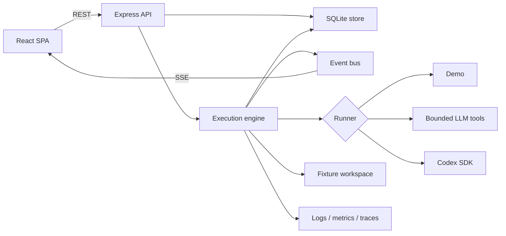
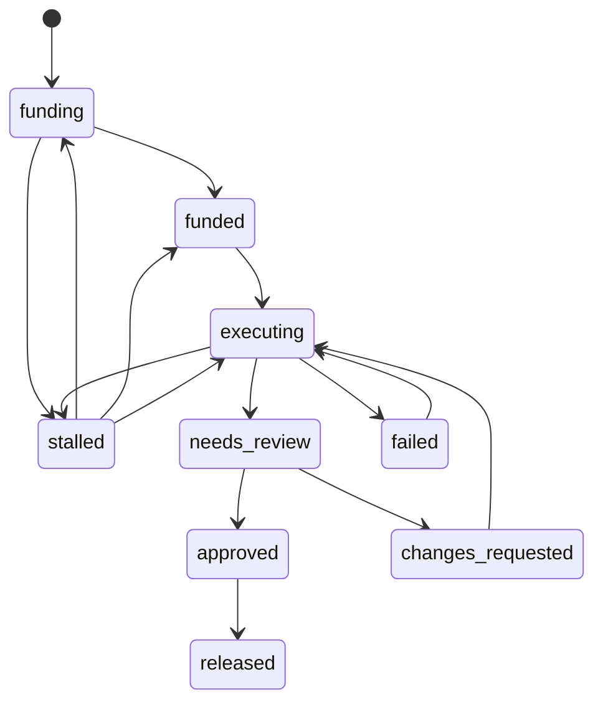

# 架構

[English](ARCHITECTURE.md)

本文件描述目前的實作。它刻意將已實作行為，與 `ROADMAP.md` 中的產品方向及 `experiment-report.md` 中的歷史觀察分開。

Runner 拓樸，以及為何多個 runner class 與模型呼叫不代表目前是 multi-agent
系統，請讀 [Agent 架構與 multi-agent 現況](AGENT-ARCHITECTURE.zh-TW.md)。

## 設計核心

CommonCommit 以一項規則為核心：

> 引擎掌管證據；執行器提供智慧。

執行器可以檢查 fixture、提出編輯、執行允許的測試能力，並說明其工作。引擎會建立工作區、記錄基準、重新執行驗證、計算差異、套用決定性審查閘門、核算點數，並控制狀態轉換。

此邊界會限制執行器可聲稱的內容，但並非完整隔離。三種執行器實作並不共用完全相同的工具路徑；控制強度取決於**實測**的隔離模式：有邊界時是每次執行一個容器，沒有時只有應用層工作區與子行程控制。將任何部分視為正式環境安全邊界前，請先閱讀 `SECURITY.md`。

## 系統概觀

應用程式由一個 TypeScript 套件與一個伺服器行程組成：

| 區域 | 職責 |
| --- | --- |
| `src/` | React 19 SPA、路由、狀態、SSE 更新與 en/zh-TW 文案 |
| `server/index.ts` | HTTP 伺服器、健康狀態端點、靜態前端與關閉流程 |
| `server/api.ts` | 市集、任務、審查、分析、活動與示範端點 |
| `server/store.ts` | 唯一的領域資料存取層 |
| `server/db.ts` | SQLite schema、可寫入的狀態目錄、ID 與時間戳 |
| `server/engine/engine.ts` | 執行生命週期、重試、帳務、產出物與核准流程 |
| `server/engine/states.ts` | 明確的任務與執行狀態轉換表 |
| `server/engine/workspace.ts` | Fixture 副本、Git 基準、測試、差異與輸出解析 |
| `server/engine/guard.ts` | 證據圍籬、遮蔽、LLM 工具寫入規則與可審查性 |
| `server/engine/tools.ts` | 提供給 `LlmRunner` 的受限能力 |
| `server/engine/judge.ts` | 對已驗證差異進行建議性審查 |
| `server/ai/` | 唯讀儲存庫分析、可行性啟發式方法與活動文案 |
| `server/observability/` | 結構化日誌、Prometheus 與選用的 Langfuse trace |

## 請求與事件流程

瀏覽器會從 `/api/bootstrap` 載入初始使用者與執行資訊，再透過 REST 讀取市集與任務資源。全域及任務專屬的 SSE 串流會傳送後續變更。

API 沒有版本前綴、身分驗證、授權或速率限制。這是 bundled UI 使用的原型 API；呼叫者不得據此推斷存在穩定的公開契約。

主要端點群組：

| 群組 | 端點 |
| --- | --- |
| 服務 | `GET /healthz`、`/readyz`、`/metrics` |
| 讀取模型 | `GET /api/bootstrap`、`/marketplace`、`/missions/:id`、`/runs/:id`、`/contributors/:id` |
| 任務流程 | `POST /api/missions/:id/pledge`、`/execute`、`/cancel` |
| 審查 | `POST /api/runs/:id/review` |
| 建立 | `POST /api/analyze`、`/campaigns/generate`、`/missions` |
| 示範 | `POST /api/demo/reset` |
| 事件 | `GET /api/stream`、`/api/missions/:id/stream` |

審查端點會忽略瀏覽器提交的權限身分，改為記錄目前的本機示範 persona。這可避免原型內的身分冒用，但仍不構成身分驗證或授權。

## 任務執行

只有工作區為 `{ kind: "fixture" }` 的專案可以執行。GitHub 儲存庫可以被分析，也可透過已驗證的真實產生器或明確標示的確定性 GitHub fallback 取得可編輯募資草稿；伺服器不會 clone 它們，因此執行仍停用。

Fixture 執行會遵循以下順序：

1. 保留任務的剩餘運算預算，並建立執行資料列。
2. 將 fixture 複製到每次執行專屬的目錄，並建立初始 Git 基準。
3. 從儲存庫檔案推導安裝與測試計畫。
4. 必要時供應相依套件，再把引擎產生的檔案與 ignored-file 清單封入基準。
5. 執行凍結的基準測試；若結果為紅燈、零測試或無法解析，會在花費模型額度前停止。
6. 呼叫所選執行器，最多嘗試三次。
7. 先比較完整工作樹與擷取的基準 commit；在引擎自有、具權威性的最終測試套件前，阻擋受保護、隱藏 ignored 或無法驗證的變更。Runner 可能先前已透過自己的工具或 SDK 路徑執行修改後程式碼，因此這是證據完整性閘門，不是隔離。
8. 由引擎重新執行凍結的測試計畫；可執行測試程式返回後，再檢查 Git 與 ignored-file 完整性，才計算相對基準的真實差異並評估審查閘門。
9. 若可檢查，執行建議性評審並建立變更證據包；不會推送分支或 PR。
10. 等候 CommonCommit API／UI 的示範決定；這不等於 GitHub 核准。
11. 核准後，更新本機任務、帳本、錢包、成就與示範採用紀錄。

真實 `llm` 與 `codex` 執行器需要下列兩者之一，而它們並不等價：

- 一個**量測過的**每次執行專屬作業系統邊界（`describeIsolation().osIsolated`），由
  `server/engine/isolation.ts` 以探測方式建立 —— 它會真的把工作區根目錄 mount 進容器，
  再讀回一個 token，因為「daemon 有回應、image 存在」和「一個工作區真的跑得起來」是兩個
  不同的問題；或者
- `ALLOW_UNSAFE_LOCAL_AGENT_EXECUTION=1`，那是人類的一句承諾，聲明這台主機可拋棄，完全
  不增加任何保護。它之所以仍受支援，只是為了讓沒有 Docker 的筆電也能開發 runner。

即使邊界已驗證，`auto` 仍維持 `demo`。隔離回答的是「這樣跑安全嗎」，它不回答「操作者是不
是要求了這件事」，而在環境中找到一組憑證並不等於取得同意。明確設定的 `EXECUTION_MODE`
才是同意訊號。

共享 nonprod 維持 `demo`：GKE pod 沒有 Docker daemon，所以那裡的探測回報 `process`，
SEC-00 的 P0 閘門在叢集內尚未達成。詳見 `SECURITY.md` 以及 `experiment-report.md` 中帶
日期的結果。

會動到點數的請求接受選用的 `Idempotency-Key` header。該 key 與其效果寫在同一個 transaction
內，所以重複不可能只做一半；而同一個 key 被用在不同請求上時會被拒絕，不會拿第一次請求的
回應敷衍過去。沒有帶這個 header 的請求並未受到保護：伺服器無法分辨「不小心重送」和「刻意
再認捐同樣金額」，只有 client 知道自己是哪一種。

### 執行器實作

| 執行器 | 運作方式 | 重要邊界 |
| --- | --- | --- |
| `DemoRunner` | 發出腳本化推理，並套用 fixture 專屬 patch | 敘事與編輯是腳本化的；引擎測試與即時執行差異來自觀察 |
| `LlmRunner` | 呼叫 OpenAI 相容的 chat-completions API，並讓模型選擇受限工具 | 模型互動與固定開場預讀都使用受圍堵的工作區 helper |
| `CodexRunner` | 以 workspace-write、停用網路、不要求核准及過濾後的子行程環境啟動 Codex SDK | 不使用七個 `LlmRunner` 工具，因此引擎會在測試前對相對基準 diff 再執行通用受保護路徑檢查 |

UI 必須標示所選的執行器。預載的歷史事件使用 `source: "demo"`；它們並非由即時引擎執行產生。

### 受限 LLM 工具

`LlmRunner` 每次嘗試最多只能有 14 輪模型對話。24 次非終止工具呼叫、200 KB 讀取預算、200 KB 累計寫入預算、單檔 80 KB 寫入上限與受限檔案列舉都會強制執行。超限操作會在計費前被拒絕；列舉與 literal 搜尋會計入其輸出或掃描的位元組。呼叫預算耗盡後只允許 `submit` 或 `abstain`。這些是決定性的成本控制，本身不等於作業系統隔離。

| 工具 | 能力 |
| --- | --- |
| `list_files` | 在筆數與輸出量上限內列出 `.git` 與 `node_modules` 以外的非 symlink 檔案，並計入讀取預算 |
| `read_file` | 讀取受圍堵的路徑，再遮蔽並圍籬其內容 |
| `search` | 以受限 literal 文字搜尋儲存庫，限制結果並計入讀取位元組 |
| `write_file` | 經過圍堵、拒絕清單、單檔與累計位元組檢查後，寫入完整檔案 |
| `run_tests` | 使用由引擎推導的測試能力 |
| `submit` | 在通過送出閘門後，要求結束本次嘗試 |
| `abstain` | 當任務需要人工決定時，刻意停止 |

在接受 `submit` 前，工具層要求至少一次寫入、至少一次測試執行、最後一次測試套件為綠色，且變更過的原始碼檔案先前已被讀取。之後引擎仍會自行執行最終測試。

### 決定性審查閘門

`computeReviewable()` 是即時執行從 `executing` 成功進入 `needs_review` 的唯一閘門。Seed 紀錄與無法執行之「要求變更」執行的復原，可以在沒有建立新引擎證據的情況下恢復審查 UI 狀態；這些路徑必須持續明確標示為未驗證。測試行程成功是必要條件，但並不充分。目前的閘門要求：

- 結束碼為 0，且沒有回報失敗；
- 差異不得為空；
- 最多變更 12 個檔案，且新增與刪除行數合計最多 800 行；
- 最終測試數量不得低於基準，且必須大於零；
- 對非文件變更，必須新增測試檔案或增加測試套件內容；
- 不得偵測到提示詞注入指標。
- 不得變更既有測試、驗證設定、lockfile、ignore 規則、CI、授權、Git 內部或其他受保護的基準路徑；
- 不得新增會影響執行、卻從產物中消失的 ignored 檔案。

閘門會從擷取的基準 commit、工作區與測試輸出推導這些事實，而非採信執行器摘要或目前 `HEAD`。無法讀取的 reporter 輸出會記錄為引擎限制，而不會被解讀為零項測試通過。整套測試成功會保存為 `suite_passed`，不等於逐條驗收條件已驗證。

### 建議性審查

通過決定性閘門後，`judge.ts` 會審查真實差異。任何已設定相容 LLM 端點的非 demo 模式（包括 Codex 模式）都會使用已設定的執行模型；否則只進行靜態差異形狀檢查。產出物會記錄結果來自 `llm` 或 `static` 審查。

評審無法推進或拒絕一次執行。它只提供風險與尚未驗證的問題供人工參考；狀態推進仍是決定性的。

## 首頁與社群表面

首頁路由開場呈現的是彙總後的影響力，而不是一份儲存庫清單，而它顯示的每一個數字都是在請求當
下由本機資料庫算出來的。沒有快取過的總計，也沒有裝飾用的常數，這是一項刻意設下的限制：主視
覺是整個產品裡最常被截圖的表面，而在那裡放上一個什麼都追溯不到的數字，是最容易不小心出貨的
一種不誠實。

每個數字的來源：

| 表面 | 由什麼推導而來 | 攜帶的 provenance |
| --- | --- | --- |
| 捐出的 token | 所有任務的 `computePledged` 總和 × 1000 | `ImpactStats.dataMode`，另加一條註記說明這是點數換算，不是量測到的 token 數 |
| 已完成的功能／已修掉的 bug | 已發布的任務依標籤切分 | `dataMode` |
| 已復活的專案 | 有已發布任務的相異專案 | `dataMode` |
| 贊助者信標 | 有真實認捐資料列的 seed 貢獻者 | `map.demoNote`，其中同時說明贊助者的地理位置從未被收集，也未被推論 |
| 即時代理活動 | 可由 RUNNING 執行的最新 `ExecutionEvent` 對應到 phase union；`v0.5.5` 首頁不再渲染缺少脈絡的活動條 | 有渲染時逐列附來源標籤；沒有執行時為空 |
| 產品卡片數字 | `Project.stars` 等 | `Project.figuresMode` |
| 影響力卡片的量級 | `Project.weeklyDownloads`／`dependents` | `ImpactCard.dataMode`，另加逐行的 `basis`，值為 `measured` 或 `editorial` |
| 時光機的過去／現在 | 觀察到的測試執行與追蹤中的 issue | 從未量測時即為缺少 |
| 時光機的未來 | 已募資但未發布的待辦及其驗收條件 | `kind: "future"`、沒有 `releasedVersion`，以及一條說明什麼都還沒發生的註記 |
| MVP 被提名者 | 募資最多的專案、每項通過測試花費點數最低者、社群票選名單 | `mvp.localNote` |

有兩條規則貫穿以上全部，而它們之所以存在，都是因為同一件事：一個被單獨顯示的數字，會失去它
所在區塊原本承載的標籤。

1. **Provenance 寫在 payload 裡，不在元件裡。** `figuresMode`、`dataMode`、`generator` 與
   `basis` 都是欄位，所以某個表面在新的地方渲染一個數字時，是連帶把這項義務一起繼承過去，而
   不是把它忘掉。
2. **未知就是缺少，絕不是零。** 選用欄位之所以是選用的，正是為了讓「沒有人量過這個」有辦法被
   表達出來。一個被渲染出來的 0 是一項量測聲明。

Source candidate `v0.5.5` 的 motion-led D 首頁只改變構圖與視覺焦點。它重用上述
payload、把 guided demo 移到獨立 route，沒有新增量測或代理執行子系統。原本的
I18N-01 回歸已在目前 source 修正；部署仍須上述獨立 delivery 與 serving 證據。

留言牆是不可信的使用者文字，而且會再次離開行程、出現在一個匯出表面上，所以留言主體是在**寫
入之前**就先經過 `redactSecrets` —— 被貼進留言裡的秘密，也絕不能還能從資料庫裡被取回。作
者、角色與時間戳都由伺服器端指派：這裡沒有身分驗證，所以由瀏覽器送來的身分只會是一個伺服器
無法查核的聲稱，而 UI 也會如實這麼說，不會讓人以為是某位已驗證的維護者回覆了。

## 狀態機

任務狀態是明確定義的，並會在執行期進行斷言：

`failed` 代表發生未預期錯誤或中斷、重啟復原已結算孤兒 run，或所有嘗試結束後仍不可審查。`stalled` 代表引擎刻意停止，例如代理棄權或疑似操弄，並將決定交回人工。

一次執行會以 `running` 開始，並只會以 `succeeded`、`failed`、`budget_exhausted`、`blocked` 或 `cancelled` 其中一種狀態結束。

## 資料與帳務

SQLite 會儲存 JSON 文件，以及專案、任務、貢獻者、認捐、執行、事件、產出物、成就、錢包與帳本項目的索引生命週期欄位。`store.ts` 是領域對外的存取層，因此未來可用其他資料庫取代 SQLite，而不需變更每個呼叫端。

運算點數是應用程式單位，約略定義為 1,000 個推論 token。它們不是貨幣、無法在示範外轉移，也不會與供應商帳單結算。

對一次執行，引擎會保留預算、記錄消耗事件，並在本機發布狀態轉換完成時，以決定性的最大餘數法退還未使用點數；整數配置總和必須精確等於退款池。帳務是原型狀態機的一部分，不是支付系統。

## 儲存庫分析與活動產生

Fixture 分析會讀取本機檔案。GitHub 分析使用公開 API 收集儲存庫中繼資料、有限數量的開放 issue、README 文字、workflow 是否存在，以及儲存庫可對應至套件時的 npm 下載端點資料。`RepoAnalysis` 會讓無法取得的量測值維持缺少狀態。伺服器會發出短效、不透明的 capability，把活動產生與任務建立綁到伺服器保存的分析與草稿 snapshot；用戶端竄改的 payload 會被忽略。建立任務時會保留缺少的熱門度量測，並以正規化來源身分而非顯示名稱綁定專案。這些容量受限、記憶體內的 bearer capability 最多有效 30 分鐘；容量淘汰或伺服器重啟可能讓它們更早失效。它們保護 payload 來源，不構成使用者身分驗證或授權。

GitHub 分析不會 clone 原始碼、不會執行測試，也不會確立某個 issue 可安全自動化。可行性值是附有標示、透明且帶校準中繼資料的啟發式結果，不是模型預測。

活動產生會呼叫已設定的 chat-completions 端點，或回傳有標示的確定性草稿。Fixture fallback 依已知 issue 撰寫；GitHub fallback 只以公開 issue metadata 為依據，刻意不宣稱知道檔案、實作方式或可以執行。活動產生與任務執行使用彼此獨立的模式。

## 可觀測性

- 結構化 JSON 日誌帶有穩定的關聯欄位，例如任務、執行、模式與 trace ID。
- `/metrics` 提供標籤基數受限的 Prometheus counter、gauge 與建置識別資訊。
- `/readyz` 回報資料庫存取與組態狀態；它不能證明 LLM 呼叫會成功。
- 只有在 URL 與兩把金鑰皆存在時，才會啟用 Langfuse。真實模型呼叫可以建立每次執行專屬的 trace 與 generation。

絕不要將秘密值或未遮蔽的儲存庫證據放入日誌、指標標籤或文件。

## 部署形態

隨附的 Kubernetes 組態會執行一個應用程式 replica，使用唯讀根檔案系統，以及供 SQLite 和工作區寫入的 `emptyDir` volume。Deployment 採用 `Recreate`，因為 rolling surge 會建立第二個可獨立寫入的 SQLite 資料庫，也可能讓新 SPA 混用舊 API。Istio sidecar、指標資源與 dashboard 範本是環境專屬整合。

單一行程同時掌管 HTTP 流量與進行中的執行。SQLite 與進行中執行的 controller 不會跨 replica 協調，因此不支援水平擴展。`Recreate` 以短暫 rollout 中斷換取單一 writer；rollout 或重新啟動仍會丟棄 `emptyDir` 狀態。維運後果與安全流程記錄於 `DEPLOYMENT.md`。
