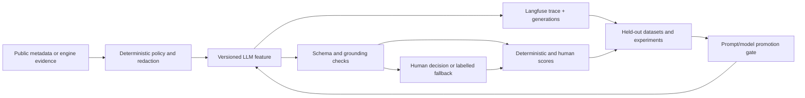

# Measured LLM expansion and Langfuse optimization plan

> **2026-09-12 LangGraph / Langfuse update:** Local agents now use persistent stage workflows and metadata-only monitoring. See [agent operations](AGENT-OPERATIONS.md) for recovery, replay protection, commands and limits. Demo controls and the serving static release remain independent.

> **Self-update lane (2026-09-12):** self-update-proposal-v1 sends only three allowlisted local frontend files plus a bounded goal to the official OpenAI endpoint. Exact-match edits, bilingual summary, provider usage when present and candidate results are persisted locally; raw source is not exported to Langfuse. [Runbook](SELF-UPDATE.md).

> **Local resilience update (2026-09-12):** Local chaos-planner-v1 and experiment-review-v1 reuse the bounded Assistance client with bilingual validated output. Live mode sends only fixed catalog/aggregate evidence and prior advisory text, never raw application state. Local Langfuse receives metadata-only traces; missing usage stays unknown and no semantic quality claim is made. [Runbook](CHAOS-AGENTS.md).

> **C reconstruction implementation:** `server/authoring/assistance.ts` supplies bounded bilingual advisory calls and labelled fallbacks. `observations.ts` exports allowlisted metadata through OTLP/HTTP JSON and local helpfulness via Scores API; it does not install the historical SDK/dashboard stack described below. Controlled transport tests establish payload containment, not external persistence or model quality. The source-controlled evaluation corpus defaults to dry-run; live evaluation requires `--live` and configuration. See [OTLP integration](https://langfuse.com/integrations/native/opentelemetry) and [Scores API](https://langfuse.com/docs/evaluation/evaluation-methods/scores-via-sdk).


[繁體中文](LLM-OBSERVABILITY-PLAN.zh-TW.md)

> Status: Phases 0–2 implemented in source for v0.5.0. Phase 3 is in progress but
> its exit gate is explicitly not met. The queue/worker protocol and commit
> capture exist in source; the deployed disposable isolation boundary does not.
> Consult
> [Feature reality](FEATURE-REALITY.md) for what is live today and
> [Validation experiments](VALIDATION-EXPERIMENTS.md) for promotion gates.

## Outcome

The next stage should make more of CommonCommit genuinely model-assisted while
making every prompt/model change measurable. The target is not “more calls”. It
is a closed optimization loop:



Success means an agent owner can answer: which feature, model, prompt version,
input class, cost, latency, fallback, engine outcome, and human outcome produced
an improvement—and can reproduce that comparison before rollout.

## Constraints inherited from the repository

These are design inputs, not negotiable assumptions:

- Shared nonproduction runs `EXECUTION_MODE=demo`. It has process isolation and
  does not meet SEC-00 for real-agent execution.
- GitHub import remains public, read-only metadata. No planned assistant may
  imply that the repository was cloned, tested, or can be executed.
- Model output is advisory. It cannot choose verification commands, move a run
  into `needs_review`, approve, reject, merge, publish, or spend/refund credits.
- Every LLM result needs an explicit generator, model, prompt version, fallback,
  and evidence boundary. Missing usage/cost is unknown, never zero.
- Trace expansion is blocked until tracing-on secret containment is measured;
  SEC-01 currently covers tracing-off only.
- English and Traditional Chinese generated fields must be evaluated for
  semantic parity; static UI translations remain source-controlled.
- Prometheus labels stay bounded. Mission IDs, repository names, prompts, paths,
  raw errors, and free text belong in access-controlled traces or logs, not
  metric labels.

## Current gaps to close first

| Gap | Current evidence | Required correction |
| --- | --- | --- |
| Fragmented model instrumentation | Campaign, explanation, runner, judge, and credential validation record different subsets of metrics/traces. Diff review omits latency observation; validation has no operation metrics. | Route all model calls through one observed client contract. |
| Incomplete trace tree | Runner calls are generations and engine phases are events, but tools are root-level counters/events rather than nested typed tool observations. | Create stable trace/span/generation/tool/evaluator names and nesting. |
| Stale release identity | Langfuse client hard-codes `commoncommit-v0.1.0`. | Use `APP_VERSION`, commit, source-tree hash, environment, and prompt version. |
| SDK/API age | Repository uses `langfuse` JS `3.38.20`; the official Observations API v2 documentation warns that data from `langfuse-js` versions below 5 may be delayed by up to ten minutes. | Test and perform an explicit SDK migration before relying on newer dashboards/APIs; retain a rollback. |
| No quality score loop | Traces carry calls and usage but not engine, human, bilingual, or grounding scores. | Define stable score configs and backfill only facts that can be derived honestly. |
| No prompt experiment gate | Prompts live in source strings and changes are compared manually. | Version prompts, link versions to generations, and run held-out dataset comparisons in CI/nonprod. |
| Trace containment unmeasured | SEC-01 deliberately disables tracing because the test has no capture sink. | Add a local fake ingestion sink and scan actual exported trace envelopes. |
| Operational dashboard stops at usage | Grafana shows request latency, tokens, run outcomes, tools, and guard signals, but not fallback, schema failure, missing usage, or trace export health. | Add low-cardinality service metrics and alerts; keep semantic quality in Langfuse. |

## Delivery sequence

### Phase 0 — Observation contract before new traffic — IMPLEMENTED

Target effort: one focused implementation slice. No new product claim.

1. Replace direct `chatComplete()` instrumentation with an `observedChatComplete`
   boundary that requires `feature`, `operation`, `promptKey`, `promptVersion`,
   model intent, trace handle, and redacted input class.
2. Upgrade Langfuse only after a compatibility probe covers ingestion, flush,
   shutdown, prompt linkage, score creation, and self-hosted endpoint behaviour.
3. Remove the hard-coded release and attach build/environment identity.
4. Introduce trace-contract tests with a local capture sink. Scan serialized
   payloads for synthetic secrets, raw repository bodies, full diffs, filenames,
   and accidental high-cardinality values.
5. Add score configs, dataset naming, prompt naming, and retention ownership.
6. Extend Grafana/Prometheus with delivery health, not prompt text or per-run IDs.

Phase exit:

- OBS-01 passes;
- 100% of real model calls have one generation with operation, model, usage
  presence, duration, finish/error class, prompt version, and release;
- trace export failure is visible;
- old and new SDK paths can be rolled back without losing application requests.

### Phase 1 — Real LLM assistance without code execution — IMPLEMENTED

These features can run in shared nonprod because they operate on bounded public
metadata or engine-owned evidence and cannot modify a workspace.

| ID | Feature | Model role | Deterministic owner | Fallback / UI label |
| --- | --- | --- | --- | --- |
| LLM-A1 | Issue triage and scope card | Classify issue type, ambiguity, affected surface stated by the issue, missing context, and candidate questions. | Server validates source capability, schema, lengths, citations to supplied fields, and forbidden execution claims. Existing heuristic remains visible. | Return heuristic-only card labelled `generator: demo/static`; never block repository analysis. |
| LLM-A2 | Acceptance-criteria assistant | Draft observable, testable criteria and flag criteria that require maintainer/product decisions. | Server rejects criteria that claim unobserved files/tests or delegate the test command to the model. Human edits remain authoritative. | Keep current issue-grounded draft and mark model assistance unavailable. |
| LLM-A3 | Campaign critic and revision | Score a generated draft for grounding, actionability, unsupported claims, and bilingual parity; revise only failed sections. | JSON schema, claim allowlist, compute floor, source capability, and maximum one revision call. | Preserve the original labelled draft; show critic unavailable rather than retrying indefinitely. |
| LLM-A4 | Evidence explainer | Summarize engine-owned baseline/final tests, diff shape, budget, provenance, and open questions for a reviewer. | It receives redacted structured evidence, cannot alter artifact/gate state, and every statement links back to a source field. | Deterministic evidence view remains primary; explanation is an optional labelled layer. |
| LLM-A5 | Shadow diff reviewer | Run the real reviewer on bundled-fixture diffs in demo mode, but store it as shadow evidence only. | Engine gate and local human decision remain unchanged; shadow result cannot appear as approval. | Static reviewer remains the official artifact. UI says “shadow model evaluation”. |

Recommended order: A1 → A2 → A4 → A5 → A3. A1/A2 create data that improves
mission quality upstream; A4/A5 connect model judgments to engine and human
outcomes; A3 adds a second generation only after its incremental value can be
measured.

Phase exit for each feature:

- LLM-01 passes on a versioned held-out dataset;
- fallback success is 100% for gateway timeout, invalid JSON, missing usage, and
  schema/grounding rejection;
- no model output changes a deterministic gate or external system;
- at least 50 human annotations exist before an online quality threshold is used
  for promotion.

### Phase 2 — Evaluation flywheel and prompt/model promotion — IMPLEMENTED

1. Create Langfuse datasets:
   - `cc-issue-triage-v1`: public issue excerpts with ambiguity and scope labels;
   - `cc-criteria-v1`: good/bad criteria plus expected rejection reasons;
   - `cc-explanation-v1`: engine evidence and required/forbidden claims;
   - `cc-shadow-review-v1`: diffs with blinded maintainer verdicts;
   - `cc-bilingual-v1`: paired semantic constraints and terminology.
2. Import failures and human corrections only after redaction and an operator
   review. Never auto-promote raw live inputs into a dataset.
3. Compare prompt/model variants offline. A candidate must beat or tie the
   accepted version on all P0 safety/grounding scores and improve the declared
   primary metric with confidence bounds; lower cost alone cannot waive quality.
4. Roll out in `shadow → 10% → 50% → 100%` feature-level stages, with a stable
   control cohort and instant fallback to the accepted prompt/model.
5. Record accepted prompt version, dataset run, score summary, commit, and owner
   in `experiment-report.md`.

### Phase 3 — Real coding agent on an isolated worker — IN PROGRESS, NOT DEPLOYED

This is not an extension of the web pod. It is a separate platform capability:

```text
web/API → durable run request → isolated disposable worker
        ← signed events/artifacts ← no service credentials, deny-by-default egress
```

Before any GitHub repository reaches a real runner:

- deploy one job/VM boundary per run with resource, time, disk, identity, and
  destination-scoped network limits;
- pass SEC-00 and SEC-01 in that exact boundary, plus AG-02 and AG-04;
- add durable queue ownership, cancellation, cleanup, and artifact storage;
- pin repository commit and toolchain; ingest structured test reports;
- run AG-01 on the held-out task corpus and maintain zero false-reviewable runs;
- keep GitHub branch/PR delivery behind separate authentication and human
  authorization. Real execution does not authorize upstream writes.

The shared deployment must remain `EXECUTION_MODE=demo` until all of those gates
are recorded as passed. A successful model call or Langfuse trace is not an
isolation result.

The source implementation for Phases 0–2 includes the v5 SDK boundary, five
advisory product surfaces, versioned curated datasets, a dry-run/sync/live
experiment CLI, stable rollout cohorts, feedback scores, dashboards and alerts.
This does not mean the 50 required human annotations already exist: until they
do, the policy may exercise the feature but may not claim statistically proven
prompt superiority. See [Phase roadmap](PHASE-ROADMAP.md) and
[experiment report](experiment-report.md).

## Langfuse data contract

### Trace and observation names

| Level | Stable name | Contents |
| --- | --- | --- |
| Session | mission ID or ephemeral authoring correlation ID | Analyze → draft → fund → run → review journey; never an email or GitHub identity. |
| Trace | `issue-triage`, `campaign-authoring`, `project-explanation`, `evidence-explanation`, `shadow-diff-review`, `mission-execution` | One user-visible operation or one execution run. |
| Retriever/span | `github-metadata`, `evidence-assembly`, `policy-check`, `schema-validation`, `engine-gate` | Non-model steps with counts/check results, not raw documents. |
| Generation | `<feature>.<prompt-key>` | Model, prompt version, usage, cost presence, duration, finish reason, request ID, and bounded redacted input/output. |
| Tool | `list_files`, `read_file`, `search`, `write_file`, `run_tests`, `submit`, `abstain` | Arguments reduced to safe categories/counts; result byte/count/status, never full file contents. |
| Evaluator | `grounding-check`, `schema-check`, `bilingual-check`, `engine-outcome`, `human-review` | Score-producing deterministic or human evaluation. |

Required trace metadata known at start:

- environment, app version, commit and source-tree hash;
- feature ID, source kind, requested mode, isolation type, experiment variant;
- configured model and prompt key/version;
- internal correlation ID and whether input is fixture/public metadata/engine
  evidence. Do not store repository URLs, names, actor names, or raw prompts as
  tags.

Required final metadata:

- resolved model/generator, outcome, fallback reason class, validation outcome,
  call/attempt count, usage-present flag, and terminal engine/human state when
  available.

### Score catalogue

| Score | Type | Source | Used for |
| --- | --- | --- | --- |
| `schema_valid` | boolean | deterministic parser | Required for every structured feature. |
| `grounded_claims` | numeric 0–1 | deterministic citations plus sampled human audit | Unsupported-claim regression. |
| `criteria_actionability` | numeric 0–1 | blinded human rubric; calibrated judge only after agreement study | A2 promotion. |
| `bilingual_semantic_parity` | numeric 0–1 | paired rubric/code checks | Generated EN/zh-TW consistency. |
| `forbidden_claim_free` | boolean | deterministic phrase/source policy | Trust-boundary gate. |
| `engine_reviewable` | boolean | `computeReviewable()` | End-to-end agent outcome, never model-authored. |
| `suite_pass_ratio` | numeric 0–1 | engine tests | Execution outcome context. |
| `human_decision` | categorical | authorized/local reviewer context, explicitly labelled | Correlation, not automatic truth. |
| `human_override` | boolean | compare shadow recommendation with human decision | Reviewer calibration. |
| `minimal_change` | numeric | diff facts/human rubric | AG-01 and reviewer optimization. |

LLM-as-a-judge scores are diagnostic until agreement with blinded humans is
measured. They cannot score themselves into promotion and never replace engine
or human scores.

### Privacy, safety, and retention

- Redact before the SDK call, not after serialization.
- Default traces store structured summaries and hashes, not full README/issue
  bodies, prompts, diffs, test logs, or feedback. A temporary debug sample needs
  explicit operator enablement, access control, short retention, and a visible
  tag.
- Record request IDs only when they are not credentials. Never record headers,
  API keys, GitHub capabilities, cookies, environment dumps, or child process
  environments.
- Flush failure must never fail a user request, but it must increment export
  health metrics and retain a bounded local diagnostic—not the payload.
- Define retention separately for online traces, annotation queues, and curated
  datasets. Dataset inclusion requires redaction plus human approval.

## Dashboards and alerts

### Langfuse dashboards

Create saved views/custom dashboards for:

1. **Feature health:** trace volume, success/error/fallback, p50/p95 latency,
   tokens and known cost by feature/model/release/prompt version.
2. **Quality:** grounding, actionability, bilingual parity, forbidden claims,
   human override, and reviewable rate over prompt versions.
3. **Cost versus outcome:** tokens/cost per valid draft, per accepted criterion,
   per reviewable artifact, and per human-approved artifact. Unknown price stays
   a separate series.
4. **Agent behavior:** turns, tool mix, read-before-write, tests-before-submit,
   retries, abstention, final gate reason, and changed-file distribution.
5. **Dataset regressions:** accepted versus candidate prompt/model experiment
   runs, with failing items directly reviewable.
6. **Safety sample queue:** schema failures, unsupported claims, redactions,
   injection flags, truncation, and high-cost outliers for human annotation.

### Prometheus/Grafana additions

Operational aggregates remain in Prometheus:

- `commoncommit_llm_fallbacks_total{operation,reason_class}`;
- `commoncommit_llm_output_validation_total{operation,outcome}`;
- `commoncommit_llm_usage_missing_total{operation,field}`;
- `commoncommit_langfuse_exports_total{outcome}`;
- `commoncommit_langfuse_flush_duration_seconds`;
- optional bounded `commoncommit_llm_calls_per_trace{operation}` histogram.

Add panels for success/error/fallback ratios, schema-valid rate, missing usage,
tokens per successful operation, export health, and p95 flush latency. Add alerts
only with a volume gate: sustained fallback >20%, structured-output invalid >5%,
or export failure >5% over 15 minutes. Initial values are hypotheses; OBS-01 must
measure a baseline before paging thresholds become authoritative.

Do not copy Langfuse semantic scores into Prometheus labels. Grafana answers “is
the service healthy?”; Langfuse answers “is this prompt/model useful?”

## Implementation backlog

| Order | Change | Primary files | Verification |
| --- | --- | --- | --- |
| 1 | Trace capture sink, payload redaction, and OBS-01 harness | `server/observability/langfuse.ts`, `server/sec01-containment.test.ts` | Synthetic canary scan with tracing on; export/retry/flush tests. |
| 2 | Central observed LLM client and stable operation taxonomy | `server/ai/llmClient.ts`, all callers, `server/observability/metrics.ts` | Every call path emits one consistent success/error record; cardinality test. |
| 3 | SDK migration, build identity, prompt linkage, and scores | package lock, observability module, environment config | Self-hosted compatibility probe and rollback test. |
| 4 | Grafana panels and alerts | dashboard/monitoring manifests | Render JSON/YAML; promtool-equivalent rule tests; empty-series cases. |
| 5 | LLM-A1/A2 APIs and UI | analyzer/campaign API, shared types, New Mission UI/i18n | Structured/fallback/provenance tests; public `prime-agent` journey. |
| 6 | LLM-A4/A5 evidence and shadow paths | engine artifacts, judge, run/review UI | Zero state/gate changes; shadow labels; human-score linkage. |
| 7 | Dataset/experiment runner and prompt promotion record | new eval CLI, validation docs/report | Reproducible dataset run pinned to commit, model, prompt and seed. |
| 8 | Isolated real-agent worker | queue/worker/isolation/deployment | All applicable P0 experiments in the deployed boundary. |

## Promotion and rollback

A prompt, model, or feature can advance only when:

1. trace containment and required-field coverage pass;
2. deterministic safety/grounding scores do not regress;
3. its held-out primary quality score improves or ties within the declared
   confidence interval;
4. p95 latency, token usage, and known cost stay within an agreed budget;
5. fallback is tested and one switch returns traffic to the accepted version;
6. a human owner records the decision and dataset run.

Rollback changes feature policy/prompt label first; it must not require an image
rollback for a prompt-only regression. If prompt management is unavailable, the
last accepted source-controlled prompt remains the fallback. A remote prompt may
never be the sole copy of a safety-critical instruction.

## Trade-offs and revisit points

- More traces improve debugging but expand sensitive-data surface and storage;
  structured summaries are the default compromise.
- A second critic/reviewer call may improve quality but doubles cost and latency;
  call it only when deterministic checks or sampling justify it.
- Remote prompt management speeds iteration but can decouple behaviour from Git;
  pin versions, retain source fallback, and record promotions.
- LLM judges scale annotation but share model biases; calibrate against blinded
  humans and preserve engine facts.
- At higher scale, move asynchronous evaluation and trace export off the request
  path, use durable queues, and define sampling by feature/risk—not random loss
  of rare failures.

## References

- [Langfuse trace best practices](https://langfuse.com/docs/observability/best-practices)
- [Langfuse scores](https://langfuse.com/docs/evaluation/scores/overview)
- [Langfuse evaluation concepts and datasets](https://langfuse.com/docs/evaluation/core-concepts)
- [Link prompts to traces](https://langfuse.com/docs/prompt-management/features/link-to-traces)
- [Langfuse metrics](https://langfuse.com/docs/metrics/overview)
- [Langfuse Observations API](https://langfuse.com/docs/api-and-data-platform/features/observations-api)
