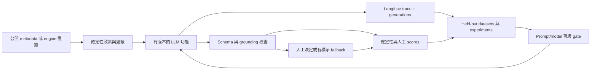

# 可量測的 LLM 擴充與 Langfuse 優化計畫

> **雲端品質驗證流程：** 六階段排程、實測證據、模型來源與能力範圍見 [Agent 實驗室](ASSURANCE.zh-TW.md)。部署證明另行記錄。

> **2026-09-12 LangGraph / Langfuse 更新：** 本機 agents 已使用持久化階段流程與 metadata-only 監控；續跑、防重播、操作指令及限制請見 [Agent 操作手冊](AGENT-OPERATIONS.zh-TW.md)。既有 Demo 鎖與網站版本維持獨立。

> **Self-update lane (2026-09-12):** self-update-proposal-v1 僅將三個允許的本機前端檔案與有界目標傳送至 OpenAI 官方端點。精確替換、雙語摘要、存在時的 provider usage 與候選結果保存在本機；不將原始碼匯出至 Langfuse。 [Runbook](SELF-UPDATE.zh-TW.md).

> **Local resilience update (2026-09-12):** 本機 chaos-planner-v1 與 experiment-review-v1 沿用有界 Assistance client 與雙語輸出驗證；live 僅傳固定目錄／彙總證據與前段建議文字，不傳原始應用狀態。本機 Langfuse 接收 metadata-only 追蹤；不宣稱語意品質，缺少 usage 保持未知。 [Runbook](CHAOS-AGENTS.zh-TW.md).

> **2026-09-12 原始碼擴充：** `/github` 新增已授權的公開 repo 原始碼快照、投入示範額度後建立 draft PR、一次 bounded Responses 改碼、無網路 Docker 測試，以及同 head 必要 CI 通過後轉正式 PR。此為獨立工作區流程；既有 metadata／fixture 路由不變。尚未部署或驗證真實上游寫入。能力、限制與測試見 [GitHub 工作區](GITHUB-WORKSPACES.zh-TW.md)。下文舊版敘述不適用於這個明確的新入口。

> **C 重建實作：** `server/authoring/assistance.ts` 提供有限範圍雙語建議與明示備援。`observations.ts` 透過 OTLP／HTTP JSON 匯出 allowlist metadata，並以 Scores API 記錄本機 helpfulness；未安裝下文歷史 SDK／dashboard 系統。受控 transport 測試只證明 payload containment，不證明外部持久化或模型品質。Source-controlled evaluation corpus 預設 dry-run，live evaluation 需要 `--live` 與設定。參考 [OTLP 整合](https://langfuse.com/integrations/native/opentelemetry) 與 [Scores API](https://langfuse.com/docs/evaluation/evaluation-methods/scores-via-sdk)。


[English canonical](LLM-OBSERVABILITY-PLAN.md)

> 狀態：v0.5.0 原始碼已完成 Phase 0–2；Phase 3 正在進行，但 exit gate 明確尚未
> 通過。原始碼已有 queue／worker protocol 與 commit capture，部署環境仍沒有
> disposable isolation boundary。目前行為以
> [功能真實性](FEATURE-REALITY.zh-TW.md) 為準，能力晉級門檻以
> [驗證實驗](VALIDATION-EXPERIMENTS.zh-TW.md) 為準。

## 目標成果

下一階段要讓更多 CommonCommit 功能真正由模型協助，同時讓每次 prompt／
model 變更都可以量測。目標不是「呼叫更多次」，而是建立封閉優化迴圈：



成功代表 agent owner 能回答：是哪個 feature、model、prompt version、input
class、cost、latency、fallback、engine outcome 與 human outcome 造成改善，
並能在 rollout 前重現比較結果。

## 從現有文件繼承的限制

以下是設計輸入，不是可任意改寫的假設：

- Shared nonprod 使用 `EXECUTION_MODE=demo`。它只有 process isolation，
  不符合真實 agent 執行所需的 SEC-00。
- GitHub 匯入維持 public、read-only metadata。任何規劃中的 assistant 都
  不得暗示 repo 已 clone、已測試或可以執行。
- 模型輸出只提供建議。它不能選驗證指令、讓 run 進入 `needs_review`、
  核准、拒絕、merge、publish，或決定 credits 支出／退款。
- 每個 LLM 結果都要有明確 generator、model、prompt version、fallback 與
  evidence boundary。缺少 usage／cost 代表 unknown，不得填成 0。
- Trace 擴充前必須先實測 tracing-on 的秘密圍堵；SEC-01 目前只量到
  tracing-off。
- 中英文產生欄位要評估 semantic parity；靜態 UI 翻譯仍由 source control。
- Prometheus label 維持低基數。Mission ID、repo name、prompt、path、raw
  error 與自由文字只能放在有存取控制的 trace／log，不能放 metric label。

## 必須先補的現況缺口

| 缺口 | 現有證據 | 必要修正 |
| --- | --- | --- |
| Model instrumentation 分散 | Campaign、explanation、runner、judge 與 credential validation 各自記錄不同 metrics／trace；diff review 沒有 latency observation，validation 沒有 operation metrics。 | 所有 model call 統一走 observed client contract。 |
| Trace tree 不完整 | Runner call 是 generation、engine phase 是 event，但 tool 主要是 root-level counter／event，不是巢狀 typed tool observation。 | 定義穩定 trace/span/generation/tool/evaluator 名稱與 nesting。 |
| Release identity 過期 | Langfuse client 硬編碼 `commoncommit-v0.1.0`。 | 改用 `APP_VERSION`、commit、source-tree hash、environment 與 prompt version。 |
| SDK／API 世代落後 | Repo 使用 Langfuse JS `3.38.20`；官方 Observations API v2 文件警告，`langfuse-js` 5 以下版本送出的資料可能延遲最多十分鐘。 | 依相容性實驗明確升級，才能使用較新 dashboard/API；必須保留 rollback。 |
| 沒有品質 score 迴圈 | Trace 有 call 與 usage，沒有 engine、human、雙語或 grounding score。 | 定義穩定 score config，只回填能誠實推導的 facts。 |
| 沒有 prompt experiment gate | Prompt 寫在 source string，變更靠人工比較。 | Prompt 版本化並連結 generation，以 held-out dataset 在 CI/nonprod 比較。 |
| Trace containment 未量測 | SEC-01 因沒有 capture sink 而刻意關閉 tracing。 | 新增本機 fake ingestion sink，掃描實際 export envelope。 |
| 維運 dashboard 只看到 usage | Grafana 有 request latency、tokens、run outcome、tools 與 guard signals，沒有 fallback、schema failure、missing usage 或 trace export health。 | 新增低基數 service metrics／alerts；semantic quality 留在 Langfuse。 |

## 交付順序

### Phase 0 — 新增流量前先統一觀測契約 — 已實作

預估：一個聚焦 implementation slice，不新增產品能力聲明。

1. 把直接 `chatComplete()` instrumentation 統一成
   `observedChatComplete` boundary；每次都必須提供 `feature`、`operation`、
   `promptKey`、`promptVersion`、model intent、trace handle 與已遮蔽 input class。
2. Langfuse 升級前先驗證 ingestion、flush、shutdown、prompt linkage、score
   creation 與 self-hosted endpoint 相容性。
3. 移除硬編碼 release，附上 build／environment identity。
4. 用本機 capture sink 寫 trace-contract tests；掃描 serialized payload 是否
   含 synthetic secret、raw repo body、完整 diff、filename 或意外高基數值。
5. 定義 score configs、dataset／prompt 命名及 retention owner。
6. Grafana／Prometheus 補交付健康訊號，不記 prompt 或 per-run ID。

Phase exit：

- OBS-01 通過；
- 100% 真實 model call 都有一個 generation，包含 operation、model、usage
  presence、duration、finish/error class、prompt version 與 release；
- trace export failure 看得見；
- 新舊 SDK 可 rollback，且不會讓 application request 遺失。

### Phase 1 — 不執行程式碼的真實 LLM 協助 — 已實作

這些能力只處理受限公開 metadata 或 engine-owned evidence，不能修改
workspace，因此可先在 shared nonprod 執行。

| ID | 功能 | Model 工作 | 確定性負責方 | Fallback／UI 標籤 |
| --- | --- | --- | --- | --- |
| LLM-A1 | Issue triage 與 scope card | 分類 issue type、ambiguity、issue 明示的 affected surface、missing context 與候選問題。 | Server 驗證 source capability、schema、長度、對輸入欄位的引用，以及禁止的執行聲明；既有 heuristic 仍可見。 | 回傳 heuristic-only card，標 `generator: demo/static`；不可讓 repo 分析失敗。 |
| LLM-A2 | Acceptance-criteria assistant | 草擬可觀察、可測試條件，標示需要 maintainer／product decision 的條件。 | Server 拒絕宣稱未知檔案／測試的條件，也不允許把 test command 交給模型；人工編輯才是權威。 | 保留既有 issue-grounded draft，標示 model assistance unavailable。 |
| LLM-A3 | Campaign critic 與 revision | 評估 grounding、actionability、unsupported claim、雙語 parity，只修未通過段落。 | JSON schema、claim allowlist、compute floor、source capability，且最多一次 revision call。 | 保留原本有標示的 draft；顯示 critic unavailable，不可無限 retry。 |
| LLM-A4 | Evidence explainer | 為 reviewer 摘要 engine-owned baseline/final tests、diff shape、budget、provenance 與 open questions。 | 只接收已遮蔽 structured evidence，不能改 artifact／gate；每句話連回 source field。 | 確定性 evidence view 仍是主體；explanation 是可選、有標示的 layer。 |
| LLM-A5 | Shadow diff reviewer | 在 demo mode 對 bundled-fixture diff 執行真實 reviewer，但只存 shadow evidence。 | Engine gate 與本機 human decision 不變；shadow result 不得顯示成 approval。 | Static reviewer 仍是正式 artifact；UI 顯示「shadow model evaluation」。 |

建議順序：A1 → A2 → A4 → A5 → A3。A1/A2 從上游改善 mission 品質；
A4/A5 把模型判斷連到 engine／human outcome；A3 只有在能量測增益後才增加
第二次 generation。

每項功能的 phase exit：

- 在有版本的 held-out dataset 通過 LLM-01；
- gateway timeout、invalid JSON、missing usage、schema／grounding rejection 的
  fallback 成功率 100%；
- model output 不得改變 deterministic gate 或外部系統；
- 累積至少 50 筆 human annotation，才能用 online quality threshold 晉級。

### Phase 2 — Evaluation flywheel 與 prompt/model 晉級 — 已實作

1. 建立 Langfuse datasets：
   - `cc-issue-triage-v1`：有 ambiguity／scope label 的 public issue excerpts；
   - `cc-criteria-v1`：好／壞 criteria 與預期拒絕理由；
   - `cc-explanation-v1`：engine evidence 與必要／禁止聲明；
   - `cc-shadow-review-v1`：帶 blinded maintainer verdict 的 diffs；
   - `cc-bilingual-v1`：雙語 semantic constraints 與術語。
2. 線上失敗與人工修正必須先 redaction 並經 operator review，不能把 raw live
   input 自動晉級成 dataset。
3. 離線比較 prompt/model variants。Candidate 必須在所有 P0 safety／grounding
   scores 不退步，並以 confidence bounds 改善宣告的 primary metric；成本較低
   不能豁免品質。
4. 依 `shadow → 10% → 50% → 100%` feature-level rollout，保留穩定 control
   cohort 與立即切回 accepted prompt/model 的能力。
5. 在 `experiment-report.zh-TW.md` 記錄 accepted prompt version、dataset run、
   score summary、commit 與 owner。

### Phase 3 — 隔離 worker 上的真實 coding agent — 進行中，尚未部署

這不是 web pod 的擴充，而是獨立平台能力：

```text
web/API → durable run request → isolated disposable worker
        ← signed events/artifacts ← 無服務憑證、deny-by-default egress
```

任何 GitHub repo 進入真實 runner 前必須：

- 每次 run 使用獨立 job／VM boundary，具 resource、time、disk、identity 與
  destination-scoped network limits；
- 在完全相同 boundary 通過 SEC-00、SEC-01、AG-02、AG-04；
- 加入 durable queue ownership、cancellation、cleanup 與 artifact storage；
- pin repo commit／toolchain，讀取 structured test report；
- 對 held-out task corpus 跑 AG-01，維持零 false-reviewable run；
- GitHub branch／PR delivery 仍需另外的 authentication 與人工 authorization。
  真實執行不代表可以寫入 upstream。

在這些 gate 全部記錄為 passed 前，shared deployment 必須維持
`EXECUTION_MODE=demo`。成功 model call 或 Langfuse trace 都不是隔離證據。

## Langfuse 資料契約

### Trace 與 observation 命名

| 層級 | 穩定名稱 | 內容 |
| --- | --- | --- |
| Session | mission ID 或暫時 authoring correlation ID | Analyze → draft → fund → run → review journey；不可用 email 或 GitHub identity。 |
| Trace | `issue-triage`、`campaign-authoring`、`project-explanation`、`evidence-explanation`、`shadow-diff-review`、`mission-execution` | 一次使用者可見操作或一次 execution run。 |
| Retriever/span | `github-metadata`、`evidence-assembly`、`policy-check`、`schema-validation`、`engine-gate` | 非模型步驟只記 counts／check results，不記 raw documents。 |
| Generation | `<feature>.<prompt-key>` | Model、prompt version、usage、cost presence、duration、finish reason、request ID，以及有界且已遮蔽的 input/output。 |
| Tool | `list_files`、`read_file`、`search`、`write_file`、`run_tests`、`submit`、`abstain` | Argument 縮成安全分類／count；result 只記 byte／count／status，不記完整檔案內容。 |
| Evaluator | `grounding-check`、`schema-check`、`bilingual-check`、`engine-outcome`、`human-review` | 產生 score 的確定性或人工評估。 |

Trace 開始時必須有：

- environment、app version、commit、source-tree hash；
- feature ID、source kind、requested mode、isolation type、experiment variant；
- configured model 與 prompt key/version；
- internal correlation ID，以及 input 是 fixture／public metadata／engine
  evidence。Tag 不得放 repo URL/name、actor name 或 raw prompt。

結束時必須補：resolved model/generator、outcome、fallback reason class、
validation outcome、call／attempt count、usage-present flag，以及可用時的
terminal engine／human state。

### Score 清單

| Score | 型別 | 來源 | 用途 |
| --- | --- | --- | --- |
| `schema_valid` | boolean | deterministic parser | 每個 structured feature 的必要條件。 |
| `grounded_claims` | numeric 0–1 | deterministic citations + sampled human audit | Unsupported-claim regression。 |
| `criteria_actionability` | numeric 0–1 | blinded human rubric；agreement study 後才可用 calibrated judge | A2 晉級。 |
| `bilingual_semantic_parity` | numeric 0–1 | paired rubric／code checks | 產生 EN／zh-TW 一致性。 |
| `forbidden_claim_free` | boolean | deterministic phrase/source policy | Trust-boundary gate。 |
| `engine_reviewable` | boolean | `computeReviewable()` | End-to-end agent outcome，絕不可由 model 撰寫。 |
| `suite_pass_ratio` | numeric 0–1 | engine tests | Execution outcome context。 |
| `human_decision` | categorical | 有清楚身分語境的 authorized／local reviewer | 只做 correlation，不是自動真相。 |
| `human_override` | boolean | shadow recommendation 與 human decision 比較 | Reviewer calibration。 |
| `minimal_change` | numeric | diff facts／human rubric | AG-01 與 reviewer 優化。 |

LLM-as-a-judge score 在與 blinded humans 的一致度被量測前只是診斷資料。
模型不能自己把自己評到晉級，也不能取代 engine／human score。

### 隱私、安全與保存

- 在呼叫 SDK 前 redaction，不可等 serialization 後才處理。
- Trace 預設只存 structured summary／hash，不存完整 README／issue body、
  prompt、diff、test log 或 feedback。暫時 debug sample 需要 operator 明確啟用、
  access control、短 retention 與可見 tag。
- Request ID 只有在不是 credential 時才記錄。不得記 header、API key、GitHub
  capability、cookie、environment dump 或 child process environment。
- Flush failure 不得讓 user request 失敗，但必須增加 export health metrics，
  並只保留有界 diagnostic，不保留 payload。
- Online traces、annotation queue、curated dataset 各自定 retention；dataset
  inclusion 必須 redaction + human approval。

## Dashboard 與告警

### Langfuse dashboards

建立以下 saved view／custom dashboard：

1. **Feature health：** 依 feature/model/release/prompt version 顯示 trace volume、
   success/error/fallback、p50/p95 latency、tokens 與 known cost。
2. **Quality：** grounding、actionability、雙語 parity、forbidden claims、human
   override、reviewable rate 隨 prompt version 的變化。
3. **Cost versus outcome：** 每個 valid draft、accepted criterion、reviewable
   artifact、human-approved artifact 的 tokens／cost；unknown price 獨立成 series。
4. **Agent behavior：** turns、tool mix、read-before-write、tests-before-submit、
   retries、abstention、final gate reason、changed-file distribution。
5. **Dataset regressions：** accepted 與 candidate prompt/model experiment runs，
   可直接查看 failing items。
6. **Safety sample queue：** schema failure、unsupported claim、redaction、
   injection flag、truncation、高成本 outlier，供人工 annotation。

### Prometheus／Grafana 新增項目

維運 aggregate 留在 Prometheus：

- `commoncommit_llm_fallbacks_total{operation,reason_class}`；
- `commoncommit_llm_output_validation_total{operation,outcome}`；
- `commoncommit_llm_usage_missing_total{operation,field}`；
- `commoncommit_langfuse_exports_total{outcome}`；
- `commoncommit_langfuse_flush_duration_seconds`；
- 可選且有界的 `commoncommit_llm_calls_per_trace{operation}` histogram。

新增 success/error/fallback ratio、schema-valid rate、missing usage、每次成功
operation tokens、export health、p95 flush latency panels。Alert 要有 volume gate：
15 分鐘內持續 fallback >20%、structured output invalid >5%、export failure >5%。
這些初始值只是 hypothesis；OBS-01 必須先量 baseline，才能把 paging threshold
視為權威。

不可把 Langfuse semantic score 複製成 Prometheus label。Grafana 回答「服務
健康嗎？」；Langfuse 回答「這個 prompt/model 有用嗎？」

## 實作 backlog

| 順序 | 變更 | 主要檔案 | 驗證 |
| --- | --- | --- | --- |
| 1 | Trace capture sink、payload redaction、OBS-01 harness | `server/observability/langfuse.ts`、`server/sec01-containment.test.ts` | Tracing-on synthetic canary scan；export/retry/flush tests。 |
| 2 | 中央 observed LLM client 與穩定 operation taxonomy | `server/ai/llmClient.ts`、所有 caller、`server/observability/metrics.ts` | 每條 call path 產生一致且唯一的 success/error record；cardinality test。 |
| 3 | SDK migration、build identity、prompt linkage、scores | package lock、observability module、environment config | Self-hosted compatibility probe 與 rollback test。 |
| 4 | Grafana panels／alerts | dashboard／monitoring manifests | Render JSON／YAML；promtool-equivalent rule tests；empty-series cases。 |
| 5 | LLM-A1/A2 API 與 UI | analyzer/campaign API、shared types、New Mission UI/i18n | Structured/fallback/provenance tests；public `prime-agent` journey。 |
| 6 | LLM-A4/A5 evidence 與 shadow path | engine artifacts、judge、run/review UI | 零 state／gate change；shadow label；human-score linkage。 |
| 7 | Dataset/experiment runner 與 prompt promotion record | 新 eval CLI、validation docs/report | Dataset run 可重現並綁定 commit、model、prompt、seed。 |
| 8 | Isolated real-agent worker | queue/worker/isolation/deployment | 在 deployed boundary 通過所有適用 P0。 |

## 晉級與 rollback

Prompt、model 或 feature 只有在以下全數成立時才能晉級：

1. trace containment 與 required-field coverage 通過；
2. deterministic safety／grounding scores 不退步；
3. held-out primary quality score 在宣告 confidence interval 內改善或持平；
4. p95 latency、token usage、known cost 在約定 budget 內；
5. fallback 已測試，且一個 switch 能把流量切回 accepted version；
6. human owner 記錄決策與 dataset run。

Rollback 應先切 feature policy／prompt label；prompt-only regression 不應需要
image rollback。若 prompt management 無法使用，最後 accepted source-controlled
prompt 是 fallback。Remote prompt 絕不可成為 safety-critical instruction 的唯一副本。

## 取捨與未來重訪點

- Trace 增加有助排錯，也擴大敏感資料與儲存面；預設採 structured summary。
- 第二次 critic／reviewer call 可能改善品質，也會增加一倍 cost／latency；只有
  deterministic check 或 sampling 證明有需要時才呼叫。
- Remote prompt management 加速迭代，卻可能讓行為脫離 Git；必須 pin version、
  保留 source fallback 並記錄 promotion。
- LLM judge 可擴大 annotation，但共享 model bias；要對照 blinded human，並保留
  engine facts。
- 規模擴大後把 async evaluation／trace export 移出 request path，使用 durable
  queue，並依 feature／risk sampling，不能隨機漏掉稀有失敗。

## 參考資料

- [Langfuse trace best practices](https://langfuse.com/docs/observability/best-practices)
- [Langfuse scores](https://langfuse.com/docs/evaluation/scores/overview)
- [Langfuse evaluation concepts and datasets](https://langfuse.com/docs/evaluation/core-concepts)
- [Link prompts to traces](https://langfuse.com/docs/prompt-management/features/link-to-traces)
- [Langfuse metrics](https://langfuse.com/docs/metrics/overview)
- [Langfuse Observations API](https://langfuse.com/docs/api-and-data-platform/features/observations-api)
