# Computer C visual candidates — NOT approved

[English / 繁體中文](PHASE2-C-VISUAL-REVIEW.zh-TW.md)

All 14 Docker captures differ from existing approved goldens. These files are review evidence only; they do not replace e2e/golden. Review uses dossier → diff → advisory per the user’s YAML-order decision. Layout, fixture content, unknown measurements and shell identity also differ. Approval has not been inferred.

## component-campaign-authoring-draft

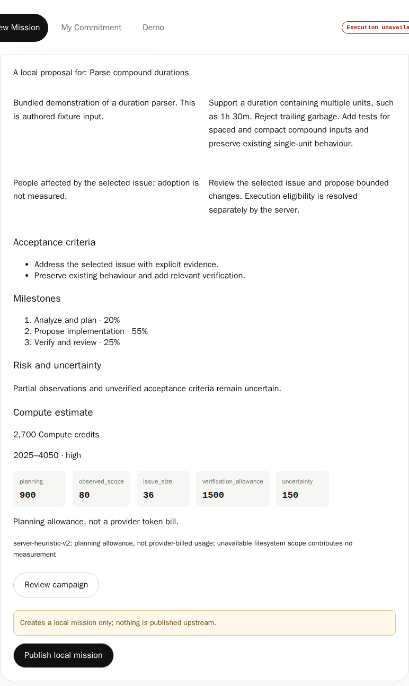

## component-diff-viewer-ready

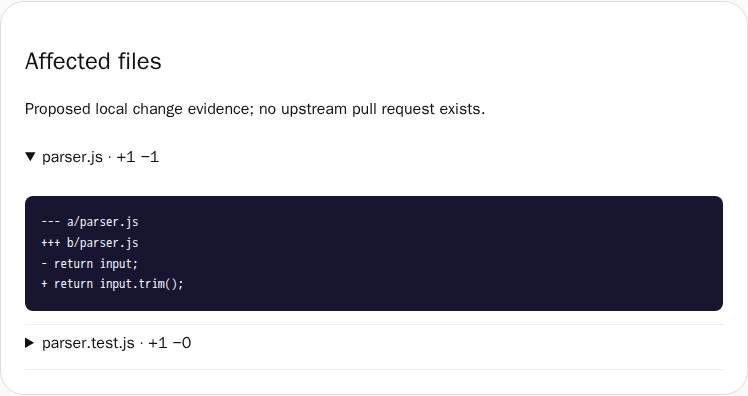

## component-repository-analyzer-results

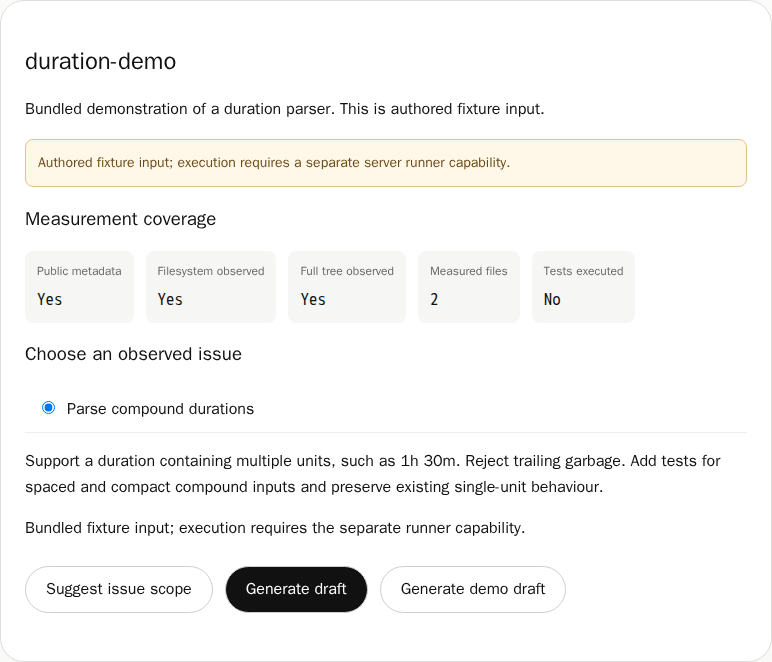

## component-review-controls-maintainer

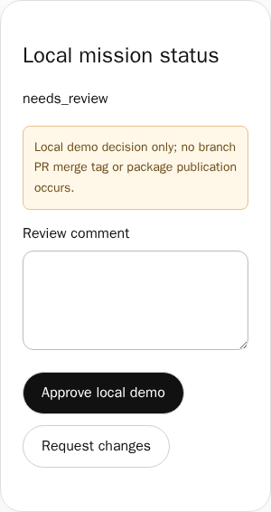

## component-review-controls-provider-read-only

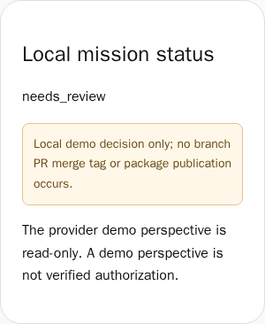

## component-verification-dossier-ready

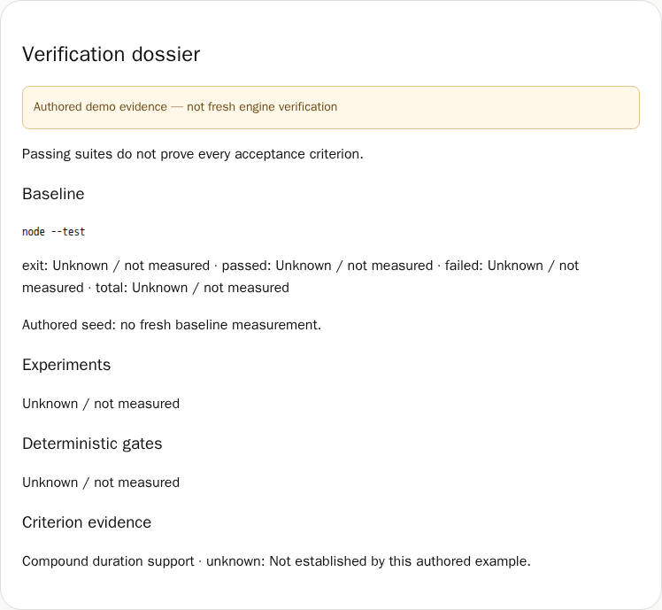

## design-concept-editorial

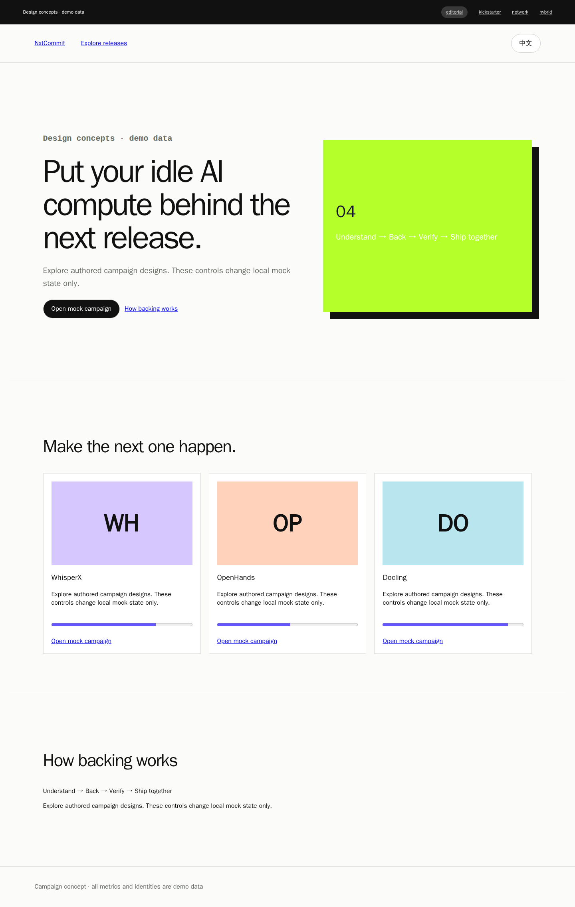

## design-concept-hybrid-campaign

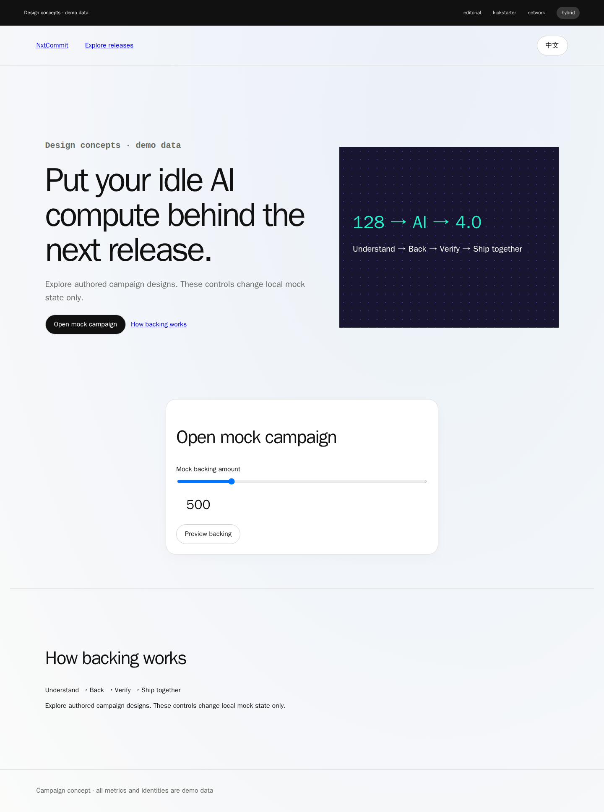

## design-concept-hybrid

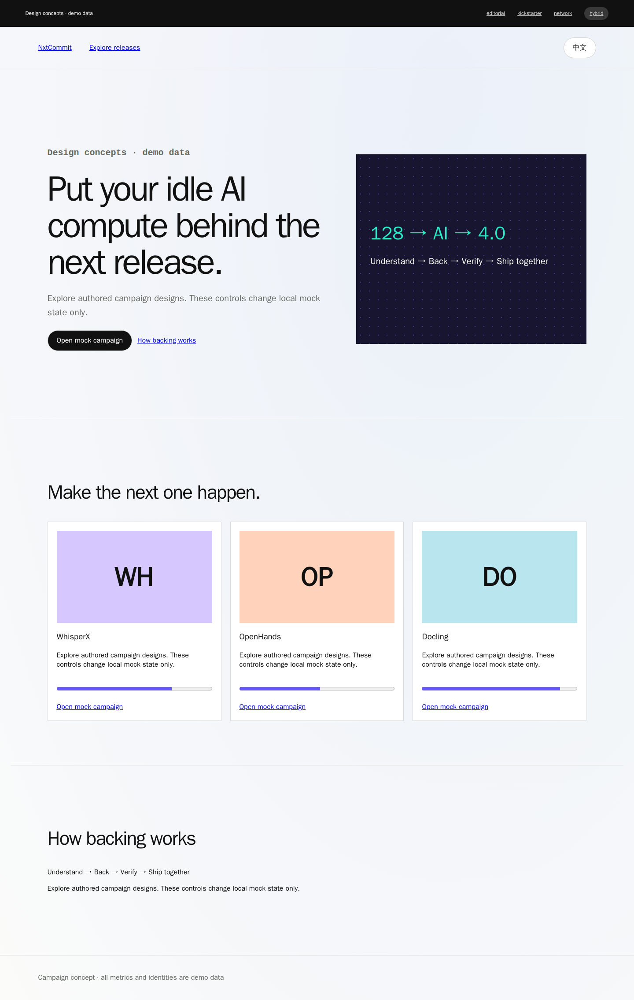

## design-concept-kickstarter

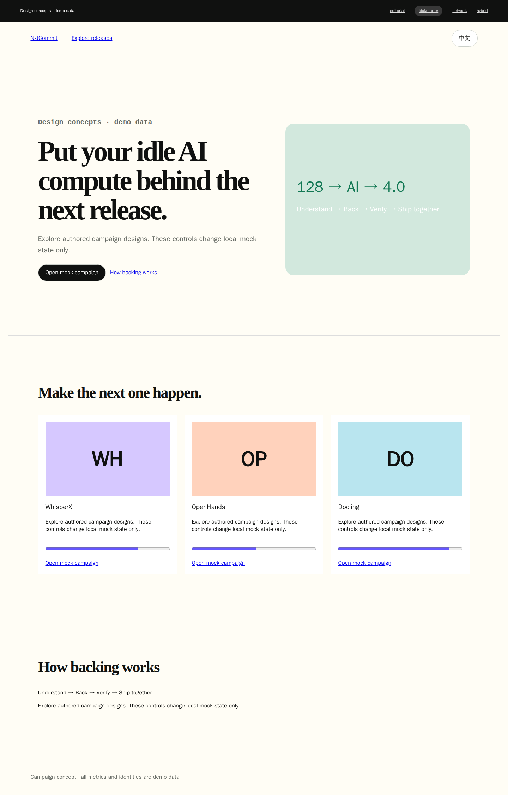

## design-concept-network

## new-mission-draft-step

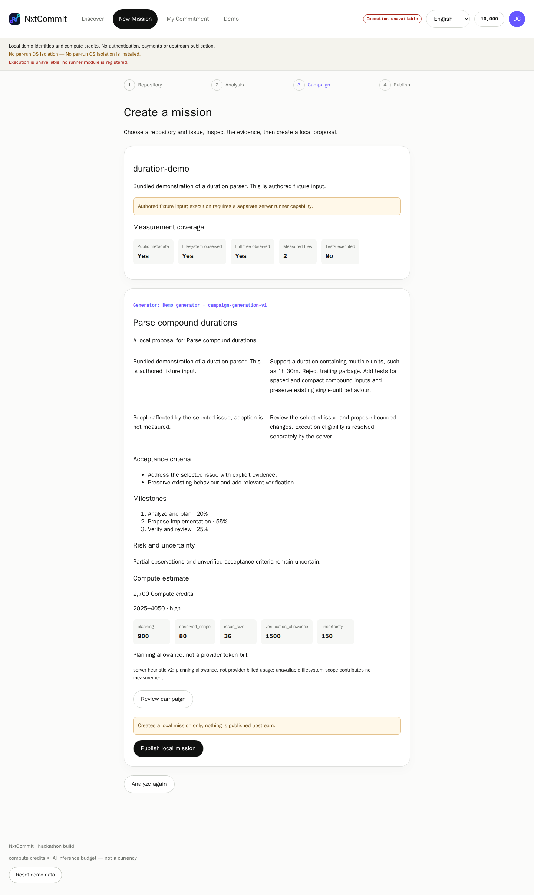

## new-mission-source-step

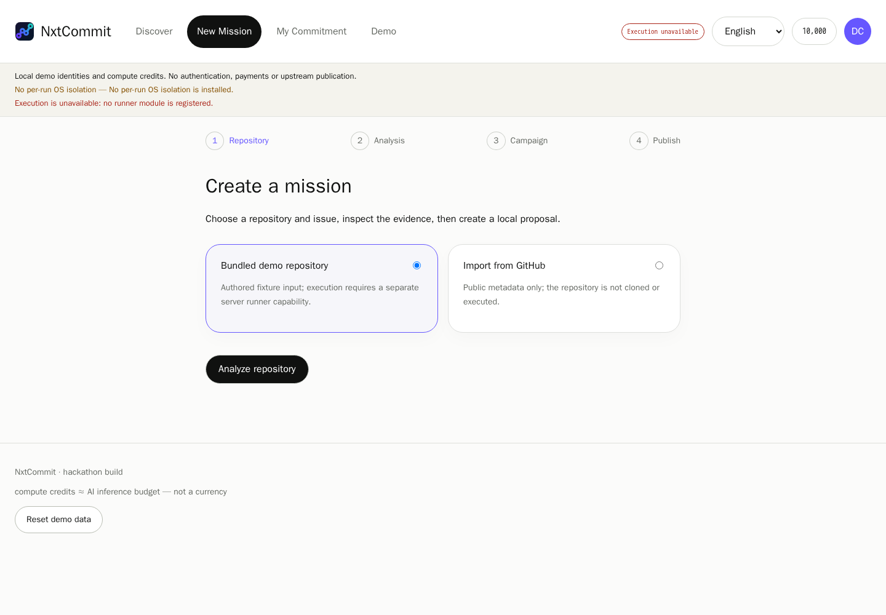

## review-dossier-ready

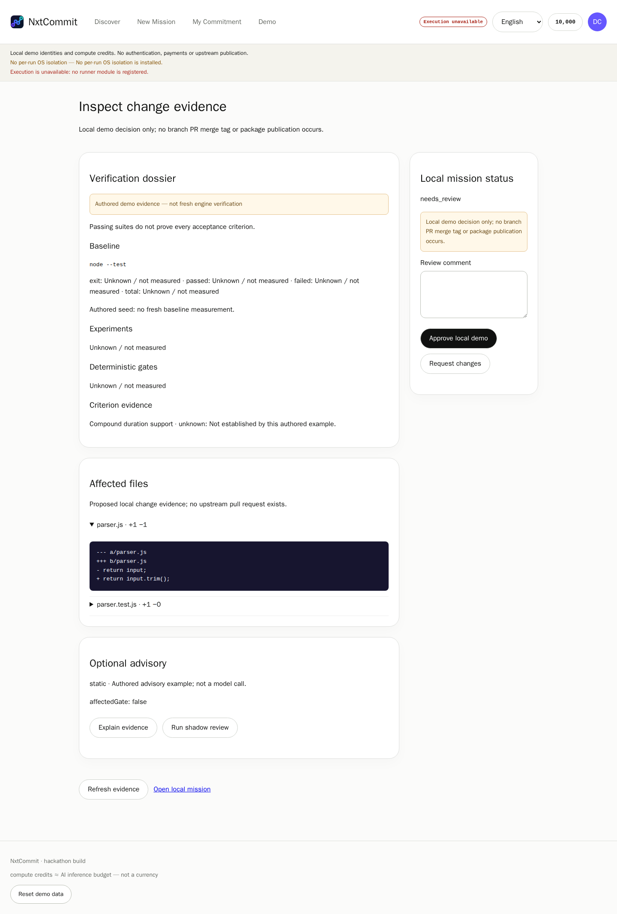
